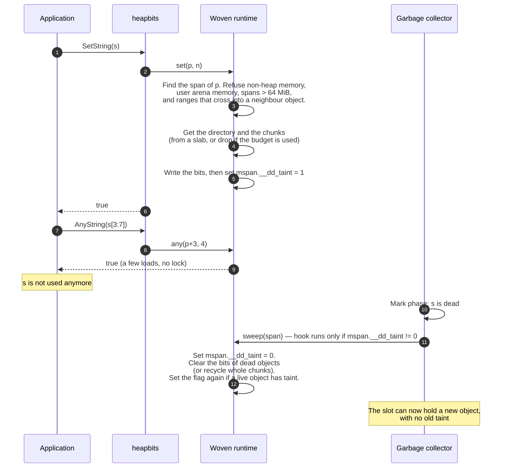

# Datadog IAST for Go

> [!NOTE]
> This project is under active development. The feature coverage is expected
> to significantly evolve, and performance characteristics of the engine are not
> stable yet.

This package provides Datadog-backed instrumentation for Interactive Application
Security Testing of Go applications. It uses `github.com/DataDog/dd-trace-go/v2`
and requires consumer applications to be compiled using
`github.com/DataDog/orchestrion`.

## Taint Tracking

Many of the functionality provided by this module relies on taint tracking:
- values (mostly `string`) obtained from untrusted _sources_ (e.g, HTTP request
  parameters) are _tainted_;
- the _taints_ are propagated as the values are combined or transformed through
  the processing of a request;
- _tainted_ values are _marked_ as they are passed through _sanitization_
  functions, as they can now be _trusted_ for certain specific operations;
- finally, when a _tainted_ value is fed into a dangerous _sink_ (e.g, an SQL
  query execution function), and no corresponding safety _mark_ has been placed,
  a _vulnerability_ is reported.

### Allocator-Backed Taint Bits

> [!NOTE]
> This storage is in the internal package `internal/taint/heapbits`. The
> `taint` package does not use it yet. Origins (sources), marks and
> propagation are not in this storage: they come in later phases.

The quick check "does this value have taint?" must be cheap, because it runs
on hot paths of the application. To make it cheap, the module keeps **one
taint bit for each byte of heap memory**, next to the metadata of the Go
allocator:

- bit `0`: the byte is not tainted;
- bit `1`: the byte is tainted.

The check is then a few memory loads, with no lock and no map lookup. The bits
only tell the caller that a slower lookup (origins, marks) is necessary.

#### How the bits get into the runtime

Orchestrion weaves the aspects of
[`internal/taint/heapbits/orchestrion.yml`](internal/taint/heapbits/orchestrion.yml)
into package `runtime` at build time:

Aspect | Change in the runtime | Purpose
---|---|---
`runtime.heapArena` | New field `__dd_taint` (a `uintptr`), plus all injected code | Points to the bit directory of the arena
`runtime.mspan` | New field `__dd_taint` (a `uint8`) | Flag: "one bit was set in this span"
`(*sweepLocked).sweep` | Hook at the start | Clears the bits of dead objects
`freegc` | Hook at the start | Clears the bits of an object that `freegc` frees at once
`mmap` | Injected non-fatal allocator, and an `init` function | Gets storage from the OS; turns the feature on (supported platforms only)

The runtime gives its functions to `heapbits` with push `//go:linkname`
variables (`__dd_iast_heapbits.set`, ...). Without weaving, these variables
are `nil`: all `heapbits` functions do nothing and report "not tainted".

The runtime also gives a pointer to a **sticky gate** word
(`__dd_taint_gate.seen`, in its own cache line, pushed as
`__dd_iast_heapbits.seen`). It is 0 until
taint can be live: the first successful `Set`, the first `Copy` of tainted
bits, or the first `heapbits.MarkLive()`. Then it is 1 for all the life of the
process. `heapbits.Live()` reads it (2 loads, inlinable). While it is 0, no
byte is tainted, so a propagation hook can skip all its work after one atomic
load.

#### Relationship to the Go heap

The Go heap is divided into **arenas** (64 MiB on 64-bit Linux and macOS).
Each arena has a metadata record (`heapArena`). An arena contains **spans**,
and a span contains **object slots** of one size class. The taint storage
follows this structure:

```text
 mheap_.arenas[l1][l2]
        │
        ▼
 ┌────────────── heapArena (metadata of one 64 MiB arena) ──────────────┐
 │ spans, pageInUse, ... (Go runtime)                                   │
 │ __dd_taint ─────────────┐  (0 = no taint in this arena)              │
 └─────────────────────────┼────────────────────────────────────────────┘
                           ▼
            ┌ directory (512 slots, one for each 128 KiB) ┐
            │ slot 0 │ slot 1 │ slot 2 │  ...  │ slot 511 │
            └────┬───┴────────┴────┬───┴───────┴──────────┘
                 │                 │  slot 1 = 0: no chunk, no taint
                 ▼                 ▼
         ┌─ chunk (16 KiB) ─┐ ┌─ chunk (16 KiB) ─┐
         │ 2048 x uint64    │ │ 2048 x uint64    │
         │ = bits of 128 KiB│ │ = bits of 128 KiB│
         │   of heap        │ │   of heap        │
         └──────────────────┘ └──────────────────┘

 The same 64 MiB arena, seen as heap memory:
 ┌─────────────────────────┬─────────────────────┬───────────────┬─────┐
 │ span (size class 48 B)  │ span (large object) │ span (stack)  │ ... │
 │ [obj][obj][obj][obj]... │ [      object     ] │ (mSpanManual) │     │
 └─────────────────────────┴─────────────────────┴───────────────┴─────┘
   mspan.__dd_taint = 1      mspan.__dd_taint = 0  never tainted
   (one bit was set)         (no sweep hook)       (Set refuses it)
```

The storage is lazy. An arena with no taint has no directory. A 128 KiB region
with no taint has no chunk. A missing directory or chunk means "no taint".

#### From an address to its bit

The Go garbage collector does not move heap objects. Thus the address of a
byte identifies the byte for all the life of the object:

```text
 address p
   │
   ├─ arena  = arena index of p            → heapArena → directory
   ├─ off    = p - arena base              (0 .. 64 MiB)
   ├─ slot   = off / 128 KiB               → chunk (or none: not tainted)
   ├─ word   = (off % 128 KiB) / 64        → one uint64 in the chunk
   └─ bit    = off % 64                    → 1 = tainted

 One uint64 word = the bits of 64 consecutive heap bytes:

   heap bytes:  [b0][b1][b2] ... [b63]
   word bits:    0   1   2  ...   63
```

The bits describe **memory**, not values. A sub-string or a sub-slice of a
tainted value uses the same memory, so it has the same bits. No key and no
length is stored.

Operation | Same memory? | Taint of the result
---|:---:|---
`s[i:j]`, `b[i:j]` | Yes | Same bits (tainted where the source is tainted)
`[]byte(s)` that the compiler makes without a copy | Yes | Same bits
`copy(dst, src)`, `string(b)` that allocates, concatenation | No | Not tainted (only `heapbits.Copy` copies the bits)
Stack values, global variables, read-only data | Not heap | Never tainted (`Set` refuses them)

#### Where the bits are stored: slabs, chunks and the budget

The feature gets memory from the OS only in **slabs** of 1 MiB. Each slab holds
64 chunks of 16 KiB. A directory also uses one chunk.

```text
 slab descriptors (fixed array in the runtime, 1024 entries = max 1 GiB)
 ┌────────────┬────────────┬─────┐
 │ slab 0     │ slab 1     │ ... │   base  = address of the 1 MiB mapping
 │ base, free │ base, free │     │   free  = 64-bit mask (1 = free chunk)
 └─────┬──────┴────────────┴─────┘
       ▼
 ┌──────────────────── slab 0 (1 MiB, from mmap) ─────────────────────┐
 │ chunk 0 │ chunk 1 │ chunk 2 │ chunk 3 │       ...       │ chunk 63 │
 │ (dir)   │ (bits)  │ (free)  │ (bits)  │                 │ (free)   │
 └─────────┴─────────┴─────────┴─────────┴─────────────────┴──────────┘

 A slot does not hold a pointer. It holds a code:
   0                         → empty (no chunk)
   1                         → claimed (allocation in progress: read as empty)
   2 + slab*64 + chunk       → this chunk of this slab
```

- **Ratio.** 1 bit for 1 byte: the bits use 1/8 of the size of the tainted
  heap regions (with a granularity of 128 KiB).
- **Budget.** The default budget is 64 MiB of slabs (enough for taint in up to
  512 MiB of heap). The maximum is 1 GiB. The budget is reserved before each
  `mmap`, so the feature never maps more than the budget. The mapped memory
  counts in the memory limit of the Go runtime (`GOMEMLIMIT`).
- **Drop, do not wait.** When the budget is used, when the OS refuses the
  memory, or when another goroutine gets the same storage, `Set` changes no bit
  and returns `false`. It never blocks.
- **Recycling.** When a dead object fully covers a 128 KiB chunk, the sweeper
  gives the chunk back to its slab (it sets the free bit). Slabs are never
  unmapped, but their chunks are used again before a new slab is mapped.

#### Life cycle of a taint bit

The bits must never stay on memory that the allocator gives to a new object.
The Go allocator uses memory again only after the sweeper frees it (or after
`freegc` frees it). The hooks clear the bits at these 2 points, so the
allocation path (`mallocgc`) has no added work:



Special cases:

- **Spans with no taint.** The sweep hook reads only the 1-byte span flag. With
  no taint in the process, this is the only added work.
- **Finalizers.** The sweeper can make a dead object with a finalizer live
  again. The hook does not clear the bits of such an object.
- **`freegc`** (`GOEXPERIMENT=runtimefreegc`) frees an object without a sweep.
  A hook clears the bits of its slot first.
- **User arenas** (`GOEXPERIMENT=arenas`) free memory without a sweep. Thus
  `Set` refuses user arena memory.
- **Tiny allocator.** Several small pointer-free values can share one 16-byte
  slot. The bits stay exact for each byte, but the runtime cannot check the
  bounds of each value in such a slot. Use the `String` and `Bytes` helpers to
  always give correct ranges.

#### Platforms

The feature is on only for:

- `linux` and `darwin`;
- on `amd64`, and on `arm64` with LSE atomics.

It is off in ASan and MSan builds. On all other targets, the woven runtime
compiles, `heapbits.Enabled()` returns `false`, and `Set` always returns
`false`.

## Cost Control

Taint tracking has non-trivial associated cost; both in terms of memory and
time. This package makes all efforts possible to minimize the associated
overhead; and a Cost Control Engine is used to ensure the overall operating cost
of IAST in your applications can remain within acceptable parameters. In
particular, taint tracking is subject to a sampling decision.

## Runtime Configuration

Configuration is read from environment variables when the package is initialized.
Malformed values produce a warning and fall back to the documented default.
Integer values outside a documented range are clamped to that range.

Environment variable | Type | Default | Description
---|---|---:|---
`DD_IAST_ENABLED` | Boolean | `true` | Enables IAST.
`DD_IAST_REQUEST_SAMPLING` | Integer from `0` to `100` | `30` | Percentage of requests sampled for IAST analysis.
`DD_IAST_MAX_CONCURRENT_REQUESTS` | Non-negative integer | `2` | Maximum number of requests that IAST processes concurrently.
`DD_IAST_VULNERABILITIES_PER_REQUEST` | Integer greater than or equal to `1` | `2` | Maximum number of vulnerabilities reported for one request.
`DD_IAST_DEDUPLICATION_ENABLED` | Boolean | `true` | Enables vulnerability deduplication.
`DD_IAST_REDACTION_ENABLED` | Boolean | `true` | Enables sensitive data redaction.
`DD_IAST_REDACTION_NAME_PATTERN` | `regexp` regular expression | Sensible built-in pattern | Pattern used to identify source names that must be redacted.
`DD_IAST_REDACTION_VALUE_PATTERN` | `regexp` regular expression | Sensible built-in pattern | Pattern used to identify source values that must be redacted.
`DD_IAST_TRUNCATION_MAX_VALUE` | Non-negative integer | `250` | Maximum number of Unicode characters retained before truncating source values, vulnerability evidence, redacted patterns, and individual evidence value parts.
`DD_IAST_MAX_RANGE_COUNT` | Non-negative integer | `10` | Maximum number of taint ranges retained for one value.
`DD_IAST_TELEMETRY_VERBOSITY` | `OFF`, `MANDATORY`, `INFORMATION`, or `DEBUG` | `INFORMATION` | Sets IAST telemetry verbosity.
`DD_IAST_DB_ROWS_TO_TAINT` | Non-negative integer | `1` | Number of database rows tainted for each request.
`DD_IAST_STACK_TRACE_ENABLED` | Boolean | `true` | Includes stack traces in vulnerability reports.

> [!NOTE]
> Boolean values are parsed using [`strconv.ParseBool`](https://pkg.go.dev/strconv#ParseBool),
> which accepts the following values:
> - Truthy: `1`, `t`, `T`, `TRUE`, `true`, `True`
> - Falsy: `0`, `f`, `F`, `FALSE`, `false`, `False`

## Vulnerability Types

Name | Severity | Implemented
---|---|:---:
Admin console active | Low | :x:
Code injection | High | :x:
Command injection | Critical | :x:
Default application deployed | Low | :x:
Default HTML escape invalid | High | :x:
Directory listing leak | High | :x:
Email HTML injection | Medium | :x:
Hardcoded password | High | :x:
Hardcoded secrets | High | :x:
Header injection | High | :x:
HSTS header missing | Low | :x:
Insecure auth protocol | Medium | :x:
Insecure cookies | Low | :x:
Insecure JSP layout | Medium | :x:
LDAP injection | High | :x:
MongoDB injection | Critical | :x:
No `HttpOnly` cookie | Low | :x:
No `SameSite` cookie | Low | :x:
Path traversal | High | :x:
Reflection injection | Medium | :x:
Server-side request forgery | Critical | :x:
Session rewriting | Medium | :x:
Session timeout | Low | :x:
SQL injection | Critical | :x:
Stacktrace leak | Medium | :x:
Template injection | High | :x:
Trust boundary violation | High | :x:
Untrusted deserialization | Medium | :x:
Un-validated redirect | High | :x:
Verb tampering | High | :x:
Weak cipher | Medium | :white_check_mark: `github.com/DataDog/dd-iast-go/iast/crypto/cipher`
Weak hash | Medium | :white_check_mark: `github.com/DataDog/dd-iast-go/iast/crypto/hash`
Weak randomness | Low | :x:
`X-Content-Type-Options` header missing | Low | :x:
`X-XSS-Protection` header disabled | Low | :x:
XPath injection | High | :x:
Cross-Site Scripting | High | :x:
