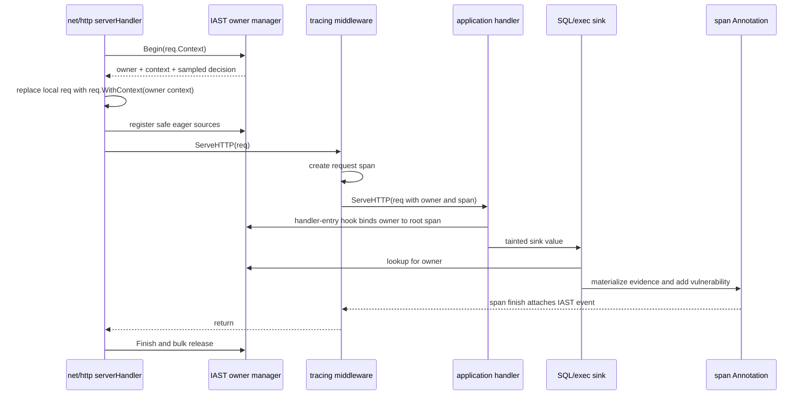
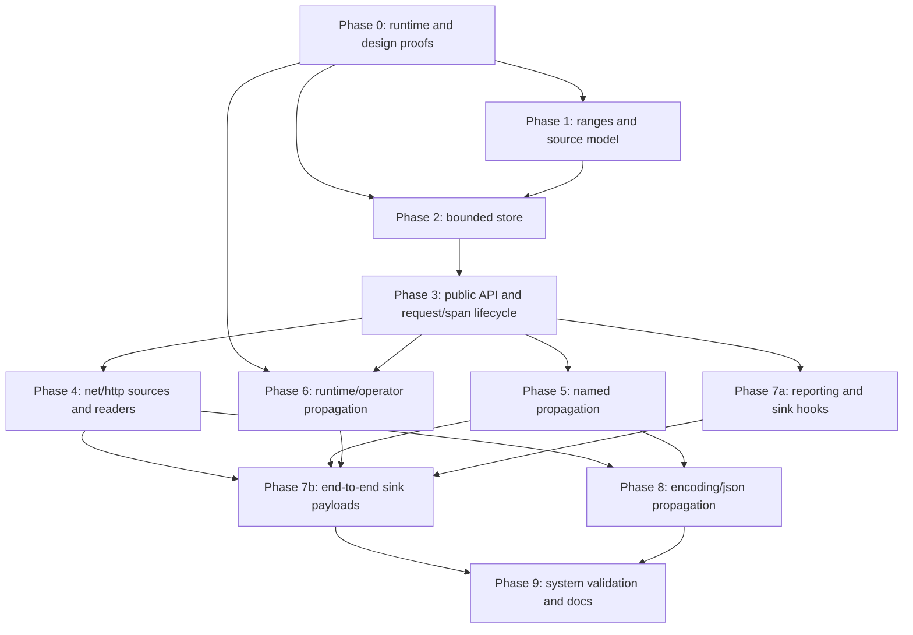

# Plan: Go taint tracking with `net/http`, SQL injection, and command injection

## Status

- **State:** All authorized phases are complete through Phase 9. Phase 6 operator propagation remains explicitly deferred by the user; normative-corpus and live-backend checks retain the approved compatibility assumptions.
- **Phase 0 results:** [taint-tracking-net-http-sqli-cmdi-phase-0.md](./taint-tracking-net-http-sqli-cmdi-phase-0.md)
- **Scope:** Interactive Application Security Testing (IAST) taint engine, Go standard-library HTTP sources, string and byte-slice propagation, `database/sql` SQL-injection sinks, and `os/exec` command-injection sinks
- **Initial supported compiler:** exact Go 1.26.6 via `GOTOOLCHAIN=go1.26.6`, with Orchestrion 1.12.2. The `go.mod` `go` directive alone does not identify the standard-library sources being woven.
- **Removal:** delete this file after the implementation is complete and accepted; keep it only in change history

## 1. Objective

Implement request-scoped taint tracking without copying the runtime design of another tracer. Preserve the cross-language Datadog IAST semantics that are visible in traces:

- each tainted range has a source origin, source name, source value, and sink-specific secure marks that record which vulnerability types a sanitizer made safe;
- evidence identifies tainted and untainted value parts in sink order;
- evidence parts refer to a de-duplicated request-level `sources` array;
- sensitive source and evidence values are redacted before they leave the process;
- vulnerability hashes, locations, stack identifiers, quotas, de-duplication, and trace retention have stable meanings;
- all storage has a hard upper bound;
- pressure or contention drops IAST data instead of blocking or breaking the host application.

The Go implementation must use Go-specific mechanisms. In particular, Java object identity, .NET weak references, and JavaScript transaction-native taint objects do not transfer to Go.

## 2. Initial feature boundary

### 2.1 In scope

1. A bounded taint engine for built-in and defined string/byte-slice types, including `type UserString string` and `type UserBytes []byte`.
2. Byte-offset range algebra with source provenance and secure marks.
3. One IAST request lifetime for each incoming `net/http` request.
4. These initial HTTP origins:
   - URI;
   - path;
   - raw query;
   - header names and values;
   - cookie names and values;
   - query and form parameter names and values;
   - path parameter values exposed by `(*http.Request).PathValue`;
   - multipart parameter names and values;
   - request-body reader provenance through common wrappers;
   - raw request body values returned through an owned-result API such as `io.ReadAll`.

   The first release binds the request body as an untrusted reader and propagates that binding through an explicit wrapper matrix such as `io.LimitReader`. Direct taint of arbitrary caller-owned `Request.Body.Read` buffers remains deferred because Go does not expose the allocation base or retained size of an interior destination slice.
5. Propagation through:
   - string concatenation;
   - string and byte-slice slicing;
   - `string`/`[]byte` conversions;
   - the specific `strings`, `bytes`, `fmt`, `strconv`, and `net/url` operations in section 11;
   - the `strings.Builder`, `bytes.Buffer`, `append`, and `copy` cases in section 11 when their semantics can be preserved.
6. SQL-injection checks for query text executed through `database/sql`, including prepared-statement execution.
7. Command-injection checks when an `os/exec.Cmd` attempts to start a process.
8. Tainted evidence formatting, redaction, source indexing, process-level de-duplication, telemetry, unit tests, instrumented tests, race tests, and overhead benchmarks.
9. An immediate `encoding/json` propagation phase for `Unmarshal` and `Decoder.Decode`.

### 2.2 Not in the initial release

- HTTP framework-specific sources outside standard `net/http`.
- Tainting values decoded through `encoding/xml`, general reflection outside the `encoding/json` integration, or third-party binders.
- Direct taint of arbitrary caller-owned `io.Reader.Read` destination buffers.
- Raw body results larger than the finalized managed-root byte ceiling. The first release returns them unchanged and records a dropped body source.
- Database row sources. `OriginSqlRowValue` and `DD_IAST_DB_ROWS_TO_TAINT` already exist, but row taint is a later source integration.
- Stored taint that outlives its originating request owner. Active foreign-owner taint reports in the first release; values cached beyond request completion need a separate bounded persistent-taint design.
- Sanitizer instrumentation. The range and reporting model supports secure marks now; specific sanitizer functions are later work.
- Other sink families such as server-side request forgery (SSRF), path traversal, cross-site scripting (XSS), Lightweight Directory Access Protocol (LDAP) injection, and NoSQL injection.
- Implicit goroutine-local request state. A goroutine must receive the request context or operate on an already-tainted value.
- General runtime instrumentation beyond the specific Phase 0 concatenation/conversion proof-of-concept. Runtime hooks are a candidate short-term mechanism, not an assumed production design.

## 3. Reference semantics

The reference implementations agree on the following externally visible contract even though their storage mechanisms differ.

| Concern | Required semantic |
|---|---|
| Source | Origin, optional name, and original source value are independent from the current transformed value. |
| Range | A value can contain ordered ranges from multiple sources. Marks apply per range and per vulnerability type. |
| Evidence | Untainted and tainted pieces occur in sink-value order. Tainted pieces refer to integer source indices. |
| Source indexing | Equal sources are de-duplicated by origin, name, and the full unredacted value. Redaction and truncation happen after de-duplication. |
| Sink suppression | A sink reports only if at least one relevant range is unsafe for that vulnerability type. |
| Quotas | Request sampling, concurrent-request capacity, per-request vulnerability capacity, and process-level de-duplication are separate controls. |
| Failure behavior | Missing context, unavailable capacity, internal errors, and unsupported propagation result in lost IAST data, not an application failure. |
| Redaction | Source-name and source-value rules combine with SQL- and command-specific evidence tokenization. |
| Location | Vulnerability hash and location do not depend on the attacker-controlled evidence value. |
| Trace retention | An accepted vulnerability keeps the trace. |

Primary reference files:

- Java:
  - `../dd-trace-java/dd-java-agent/agent-iast/src/main/java/com/datadog/iast/taint/TaintedMap.java`
  - `../dd-trace-java/dd-java-agent/agent-iast/src/main/java/com/datadog/iast/taint/Ranges.java`
  - `../dd-trace-java/dd-java-agent/agent-iast/src/main/java/com/datadog/iast/propagation/PropagationModuleImpl.java`
  - `../dd-trace-java/dd-java-agent/agent-iast/src/main/java/com/datadog/iast/propagation/StringModuleImpl.java`
  - `../dd-trace-java/dd-java-agent/agent-iast/src/main/java/com/datadog/iast/sink/SqlInjectionModuleImpl.java`
  - `../dd-trace-java/dd-java-agent/agent-iast/src/main/java/com/datadog/iast/sink/CommandInjectionModuleImpl.java`
  - `../dd-trace-java/dd-java-agent/agent-iast/src/main/java/com/datadog/iast/model/VulnerabilityBatch.java`
  - `../dd-trace-java/dd-java-agent/instrumentation/servlet/javax-servlet/javax-servlet-common/src/main/java/datadog/trace/instrumentation/servlet/http/HttpServletRequestInstrumentation.java`
- .NET:
  - `../dd-trace-dotnet/tracer/src/Datadog.Trace/Iast/DefaultTaintedMap.cs`
  - `../dd-trace-dotnet/tracer/src/Datadog.Trace/Iast/Ranges.cs`
  - `../dd-trace-dotnet/tracer/src/Datadog.Trace/Iast/IastRequestContext.cs`
  - `../dd-trace-dotnet/tracer/src/Datadog.Trace/Iast/IastModule.cs`
  - `../dd-trace-dotnet/tracer/src/Datadog.Trace/Iast/VulnerabilityBatch.cs`
  - `../dd-trace-dotnet/tracer/src/Datadog.Trace/Iast/SensitiveData/EvidenceRedactor.cs`
- JavaScript:
  - `../dd-trace-js/packages/dd-trace/src/appsec/iast/taint-tracking/operations.js`
  - `../dd-trace-js/packages/dd-trace/src/appsec/iast/taint-tracking/plugin.js`
  - `../dd-trace-js/packages/dd-trace/src/appsec/iast/analyzers/sql-injection-analyzer.js`
  - `../dd-trace-js/packages/dd-trace/src/appsec/iast/analyzers/command-injection-analyzer.js`
  - `../dd-trace-js/packages/dd-trace/src/appsec/iast/vulnerabilities-formatter/index.js`
  - `../dd-trace-js/packages/dd-trace/src/appsec/iast/vulnerability-reporter.js`
  - `../dd-trace-js/packages/dd-trace/src/appsec/iast/overhead-controller.js`

Do not copy these implementations mechanically. Use their tests and payload format as behavioral evidence.

## 4. Existing Go foundation and gaps

The repository already has:

- sampling and concurrent annotation capacity in `internal/spans/annotation.go`;
- event attachment and trace retention in `internal/spans/orchestrion.go`;
- vulnerability location and stack capture in `internal/vulnerability/report.go`;
- `Event`, `Source`, `Evidence`, `ValuePart`, `Location`, and `Vulnerability` wire models in `internal/model`;
- source and vulnerability enumerations in `internal/model/constants`;
- build-time and runtime IAST telemetry counters in `internal/instrumentation/telemetry`;
- all configuration names needed for basic taint reporting in `internal/config/config.go`;
- the Orchestrion `inject-declarations` and `go:linkname` pattern in `iast/crypto/*/orchestrion.yml`;
- an empty `taint` package and empty `taint/orchestrion.yml`.

The missing parts are:

- a request owner for taint data that can exist before an application trace span is created;
- bounded identity storage for strings and byte slices;
- range and secure-mark operations;
- HTTP source instrumentation;
- propagation instrumentation;
- tainted sink lookup;
- source de-duplication and evidence-value-part construction;
- SQL and command evidence redaction;
- bounded process-level vulnerability de-duplication;
- payload-size protection;
- end-to-end tests and overhead benchmarks.

## 5. Value identity and backing-memory lifetime

The proposed lookup key starts from `unsafe.StringData` or `unsafe.SliceData`: the address of the first byte, plus the visible byte length and value kind. This is fast and makes aliases observable, but a plain address is not a durable object identity. Go exposes real virtual addresses, not logical generational handles. Stack slots and collected heap allocations can reuse the same numeric address, and equal values can share static backing storage. The design must therefore pair address lookup with explicit lifetime and provenance rules.

### 5.1 Runtime facts and required reconfirmation

Go 1.26.6 source inspection and isolated probes established these facts:

- string data can be in read-only static memory, global small-value tables, a goroutine stack, or the heap;
- `net/textproto` interns common header names, and application literals can share their backing address;
- `strconv` can return small values from shared static storage;
- `unsafe.StringData("")` can be `nil`, and `unsafe.SliceData` for a zero-capacity slice returns an unspecified address; empty values contain no attacker-controlled bytes, so the engine can safely treat them as untainted;
- Go pointers are real virtual addresses; there is no generational logical-address layer for ordinary objects;
- forced-GC allocation probes reused heap addresses, and repeated non-escaping operations reused stack addresses;
- `weak.Make` uses heap weak handles, but `weak.Make(unsafe.StringData(literal))` reached the runtime's unrecoverable `getWeakHandle on invalid pointer` throw;
- `runtime.AddCleanup` on non-heap data reached `runtime.AddCleanup: ptr not in allocated block`;
- `weak.Make` and `AddCleanup` can make a parameter escape, but escape analysis does not relocate a string literal, an existing static backing, or every interior pointer into a new independent allocation. Escape is a performance effect, not a general validity proof;
- `uintptr` is an integer with no pointer semantics: it does not keep an allocation alive, and converting a stored `uintptr` back to `unsafe.Pointer` is not valid in general;
- `unsafe.Pointer` does have pointer semantics when it points into a valid Go object and is stored in a GC-visible pointer slot. It keeps that complete object alive and lets the GC track the pointer. This prevents reclamation/address reuse while stored, but it is a strong reference, not a weak identity, and an interior pointer can pin an allocation much larger than the visible value;
- an interior substring pointer keeps the complete parent allocation alive, so charging only `len(substring)` does not bound retained memory.

The Go 1.26.6 evidence is in `src/unsafe/unsafe.go`, `src/weak/pointer.go`, `src/runtime/mheap.go`, `src/runtime/mcleanup.go`, `src/runtime/string.go`, `src/cmd/compile/internal/walk/expr.go`, and `src/net/textproto/reader.go`. Phase 0 reruns the weak-pointer, cleanup, heap-reuse, stack-reuse, and interior-retention probes in isolated subprocesses for every supported toolchain. This guards against runtime changes and makes the claims reproducible.

There is no supported, non-fatal runtime query that tells this module whether an arbitrary data pointer is a heap pointer. Calling `weak.Make` is not such a query because its invalid-pointer path is a runtime throw. `weak.Make` is safe only when provenance establishes that the argument is a pointer to a Go object that the compiler/runtime can place on the heap—for example, a typed object created with `new(T)` or a tracer span allocated by the tracer. It is not safe for pointers manufactured from `unsafe.StringData`, `unsafe.SliceData`, reflection, `uintptr`, or an unknown interior address. `weak.Make`'s escape operation can move an addressable Go variable to the heap, but it cannot turn read-only data or an arbitrary backing-store interior pointer into an independent heap object.

The first taint design therefore does not use weak pointers for string/slice data or object bindings. Object bindings keep bounded strong typed references until owner completion. The existing `weak.Pointer[tracer.Span]` use remains valid because the tracer span has known heap-object provenance. A process-global `uintptr`-only value map is rejected. The value index uses `uintptr` only as a non-owning comparison key while a managed string/slice root keeps the complete allocation alive; it never reconstructs a pointer from a stored integer. Using `unsafe.Pointer` as the index key would keep every key's object alive, including tombstones, and would bypass the explicit root-byte accounting.

### 5.2 Managed backing allocations

A **managed root** is the complete backing allocation that the engine keeps alive and charges to a hard byte budget. A **value entry** is one visible string or byte-slice window into that root, with its own address, length, ranges, and source provenance. The value entry stores a root identifier, not another strong substring or parent-string reference; the one root anchor keeps the complete backing alive. Several substrings can share one root without charging or retaining the parent several times.

Only a managed tainted value can enter the initial identity index. The public source operation returns a replacement value:

```text
managed = TaintString[T ~string](owner, source, original) T
managed = TaintBytes[T ~[]byte](owner, source, original) T
```

The source hook must install the returned value in the application-visible field, map, slice, or function result. `TaintString` clones the source into unique backing storage before it records taint. `TaintBytes` also returns owned backing storage; it is valid only where replacing the result preserves the API contract. This copy-on-taint rule prevents an interned header name or small formatted value from tainting an unrelated equal literal.

Use constrained generic helpers at application call sites so defined types such as `type UserString string` and `type UserBytes []byte` retain their nominal type. Standard-library linkname bridges remain concrete because their target signatures use built-in types. Identity storage normalizes them to the structural `string` or `bytes` kind, but every injected expression must return the original defined type. Aliases such as `type UserString = string` need no special treatment.

A stored value still converts its current data address to `uintptr` for fast equality lookup, but its entry refers to a request-owned **root anchor**. The root's strong `string` or `[]byte` field—not the integer key—provides the pointer semantics and lifetime. The engine creates or adopts a root anchor only when it knows the complete allocation and can charge it once. A slice or substring propagation entry refers to its parent's root anchor and does not create or charge a second anchor. If an operation returns a value outside every input root, the propagation hook clones the result before returning it unless an operation-specific audit proves that the result starts at a complete new allocation. Audited allocating operations such as allocating `strings.Join` and reallocating `append` can adopt the result directly and charge its conservative allocation size. Concatenation needs extra care: the compiler can provide a stack buffer, and the runtime can return one input unchanged. A runtime hook can adopt only when `buf == nil` and the result does not alias an input; otherwise it shares the input root or returns a managed clone. A source-expression hook must clone on the tainted path unless its proof-of-concept establishes equivalent residency information. Fast paths that return an input reuse that input's root. Operations that can return static storage, such as small-value formatting, must clone. An in-place `append` keeps the existing root. Cloning an `append` result is prohibited because it changes capacity and aliasing.

This produces two key forms:

```text
root:    (root address, root size, owner) -> strong managed anchor
value:   (value address, value length, kind, owner) -> root anchor + ranges
```

| Scenario | Root action | Result |
|---|---|---|
| HTTP or other source value | Clone and create a root. | Return the managed replacement and record ranges. |
| Substring or subslice of a managed value | Share the parent's root. | Add a value entry without another root charge. |
| Operation returns an input unchanged | Share that input root. | Reuse its provenance. |
| Audited operation returns a complete heap allocation | Adopt and charge the result. | Preserve allocation count and aliases. |
| Result can be static or stack-backed | Clone before storing. | Return a heap-managed replacement on the tainted path. |
| In-place `append` | Keep the existing root and update generation. | Preserve capacity and aliases. |
| Reallocating `append` | Adopt the complete new slice allocation. | Preserve capacity and aliases. |
| Complete allocation cannot be identified and cloning changes semantics | Do not store the result. | Return the original result and increment a drop counter. |
| Any capacity or byte limit is full | Do not create the root or entry. | Keep existing entries and increment the relevant drop counter. |
| Owner finishes | Release all owned roots synchronously. | Invalidate its value entries. |

The implementation must not adopt an arbitrary interior pointer as a new root. In practice, a drop occurs when the engine cannot clone without changing observable aliasing or capacity—for example, an arbitrary caller-owned interior `[]byte` destination—or when any root/value/range/byte limit is full. It does not drop ordinary source strings, substrings of managed roots, audited allocating operations, or owned results within their limits.

The first version does not track empty or one-byte values. Empty values carry no attacker-controlled bytes. Cloning can make one-byte values unique, but excluding them keeps static-small-value behavior out of the first unsafe-adjacent implementation.

Managed retention is acceptable only with all of these hard limits:

- maximum active request owners, with a hard process ceiling independent of configuration;
- maximum root anchors and value entries per request;
- maximum charged root bytes per request;
- maximum root anchors, value entries, and charged root bytes process-wide;
- maximum bytes for one managed root;
- maximum object bindings and sources per request;
- maximum ranges per value with a non-configurable hard ceiling;
- synchronous anchor release at request completion;
- drop-new behavior when any limit is reached.

Phase 0 prototypes and benchmarks set the exact constants. Initial measurements evaluate these provisional ceilings rather than treating them as API contracts:

- at most 64 active owners process-wide; clamp `DD_IAST_MAX_CONCURRENT_REQUESTS` to this internal safety ceiling, and treat `0` as no IAST owner acquisition;
- 4,096 value entries and 2 MiB of charged roots per request;
- 16,384 value entries and 8 MiB of charged roots process-wide;
- 64 KiB for one managed root;
- 256 object bindings and 256 sources per request;
- configured range count capped at a hard maximum of 64.

Charge each root by a conservative allocation-size class, not only its logical length. For a managed slice, include capacity. For a managed string clone, round the requested size up conservatively. Phase 0 must prove with `runtime.MemStats` that many substrings of a large parent charge and retain one bounded root, not one short value per substring.

Do not compute any limit only as `MaxConcurrentRequests × value` because `DD_IAST_MAX_CONCURRENT_REQUESTS` currently accepts very large values.

## 6. Architecture


### 6.1 Package layout

The exact exported API is subject to implementation review, but package responsibilities must remain separated.

| Path | Responsibility |
|---|---|
| `taint/` | Public, low-level taint and propagation API. It must be usable by future external source, propagation, sanitizer, and sink integrations. |
| `internal/taint/ranges/` | Pure range algebra and secure-mark bitsets. No global state and no instrumentation dependencies. |
| `internal/taint/store/` | Bounded owner-tagged root anchors, value index, and object bindings for request URL/body attribution. |
| `internal/taint/request/` | Request owner, source table, quotas, active lifetime, context carrier, span binding, and owned-entry handles. |
| `internal/taint/evidence/` | Convert sink ranges to `model.ValuePart` and request sources to `model.Source`. |
| `internal/taint/redaction/` | Source redaction plus SQL and command evidence tokenization. |
| `internal/dedup/` | Fixed-capacity, time-bounded process-level vulnerability de-duplication. |
| `iast/net/http/sources/` | Standard `net/http` source and reader-provenance hooks. |
| `iast/database/sql/sinks/` | `database/sql` SQL-injection sink hooks and reporting wrapper. Reserve `iast/database/sql/sources/` for later database-row sources. |
| `iast/os/exec/` | `os/exec` command-injection sink hooks and reporting wrapper. |
| `iast/encoding/json/` | `encoding/json` byte/reader-to-decoded-string propagation hooks. |

`orchestrion.tool.go` must import every new package that contains an `orchestrion.yml` file. `README.md` must list the SQL-injection and command-injection packages and the supported source/propagation limitations.

### 6.2 Request owner and global index

A propagation operation usually has no `context.Context`. A request-only map cannot support `strings.Join`, `a + b`, or builder operations. The index must be globally reachable, but every root anchor, value entry, and object binding remains owned by one active IAST request.

The value index maps one managed value key to a bounded set of owner-specific entries:

```text
(ptr, len, kind) -> [(owner A, root A, ranges), (owner B, root B, ranges), ...]
```

The owner set supports explicit shared managed backing. Lookup returns owner-separated taint. A propagation operation creates a result entry independently for each contributing owner.

Sink attachment and provenance ownership are separate concerns. A sink reports every unsafe matching entry from any active owner, not only entries owned by the sink request. It materializes those sources into the sink event and attaches the vulnerability to the span active at the sink. If no span is in the supplied context, it uses the current tracer span when available; otherwise it can use a matched owner's bound span or the existing orphan-vulnerability span. Ambiguous ownership must not suppress a real vulnerability.

Foreign-owner lookup returns a bounded immutable snapshot, not live request-local source IDs. Load the source object through an atomic pointer, copy its ranges/source metadata, and verify owner generation/state before accepting the snapshot. `Finish` can clear its slot afterward without invalidating the reporter's local strong reference. If the snapshot cannot be completed consistently, drop only that foreign contribution and count a foreign-owner race drop; never emit a tainted `ValuePart` without a materialized source.

The initial owner cleanup still removes value entries when their source request ends. Persistent values that survive into a later request therefore need a separate, bounded stored-taint lifetime design. Flag cross-request/stored injection as a required follow-up; do not keep request anchors indefinitely merely to support it.

A separate, bounded object-binding table associates a request's `*url.URL` and supported body reader objects with the owner. It uses owner-held strong typed references, with its own count limit, and removes them with the owner. Do not use `weak.Make` on an interface-derived or unsafe pointer merely to test heap residency. A later weak binding would require construction-time typed heap provenance and isolated safety tests.

Each owner records bounded slot handles. `Finish` first atomically changes the owner to a terminal state, which rejects all later writes. It then clears anchor and entry slots synchronously and changes each empty index bucket to a reusable tombstone. Inserts reuse tombstones, so stale keys cannot permanently saturate the fixed table. Cleanup must not be a droppable `TryLock` write. Prefer generation-tagged preallocated slots whose anchor pointer can be atomically replaced with `nil`; stale index references contain no strong anchor and fail owner-generation validation. If the implementation uses locks instead, Phase 0 must prove a bounded cleanup path and an opportunistic dead-owner scavenger. A failed fast-path cleanup is never allowed to retain an anchor indefinitely.

Use fixed-capacity, sharded open-addressing tables instead of the repository's existing `xsync.Map`. Keep the maximum load factor below a Phase 0 measured limit (start with 50%, so 16,384 process-wide value entries use at least 32,768 slots); the entry limit is not the slot count. `xsync.Map` is suitable for the bounded span annotation count, but it can grow and does not expose the fixed slot/byte accounting and synchronous owner cleanup required for taint values. "Fixed-capacity" means the implementation allocates a hard maximum number of slots once, probes at most a fixed number of slots, reuses tombstones, and drops a new entry when no slot is available. It does not use a built-in map that can grow or an overflow linked list whose collision nodes can allocate without a bound. This gives a calculable memory ceiling and bounded adversarial-collision work. Read and ordinary write critical sections have bounded work. Ordinary propagation can use `TryRLock`/`TryLock`; contention is a taint miss or dropped write. Cleanup has the stronger rule above. The production path must not retry indefinitely or create an entry after its owner starts closing.

### 6.3 Entry and range shape

A conceptual entry is:

```go
type entry struct {
    ownerID uint64
    kind    valueKind // string or bytes
    rootID  uint32    // request-owned, fully charged managed backing
    ranges  boundedRanges
}

type Range struct {
    Start    uint32 // byte offset
    Length   uint32
    SourceID uint16 // request-local source table index
    Marks    uint64 // bit position is the constants.VulnerabilityType numeric value
}
```

This is not a required literal definition. The implementation can use parallel arrays or inline storage after measurement.

Invariants:

1. `Length > 0`.
2. `Start + Length <= value byte length`, with checked arithmetic.
3. Ranges are sorted by `Start`.
4. Evidence-facing ranges do not overlap. If two source operations cover the same bytes, first provenance wins and later ranges are clipped or dropped deterministically.
5. Range count never exceeds the effective configured limit or the hard limit.
6. Source identifiers are valid for the entry owner.
7. Marks are intersected when a coarse operation combines bytes with different protection. This is a Go safety decision: a union could invent protection and hide a vulnerability. Reference tracers do not expose one consistent coarse-mark rule.
8. `Marks` uses the 1-based numeric `constants.VulnerabilityType` value as its bit position; bit 0 is unused and no separate SQL/CMD ordering exists. A compile-time assertion requires `constants.VulnerabilityTypeCount < 64`.
9. Any invariant failure drops the result. It must not panic in production.

### 6.4 Byte slices and mutation

`[]byte` support is required, but only managed byte roots are sound:

- retaining an arbitrary interior slice can keep an unknown larger allocation alive;
- retaining a slice can change escape behavior;
- in-place mutation keeps the address and can invalidate provenance;
- overlapping subslices have different start addresses, so a generation keyed only by one slice start is incorrect;
- `append` can keep or replace the backing array;
- arbitrary index assignments are not visible to Orchestrion 1.12.2.

The initial byte API therefore clones and returns a managed slice, or adopts a complete result whose start and capacity are known, such as an instrumented allocation result. Subslice entries reference that managed root. An instrumented write increments the root generation in O(1) before it installs new ranges. Each value entry records the generation at creation and is valid only when it equals the root generation. Reclaim stale entries opportunistically with bounded work; do not sweep every value for the root on each write. Set a per-root value-entry limit so stale entries cannot consume the complete request table.

Do not taint an arbitrary caller-owned `Read(p)` destination because the engine cannot determine the allocation base or retained size of an interior `p`. Support owned results such as an instrumented `io.ReadAll` return first. Direct read-buffer support requires a later mechanism that proves the complete allocation and instruments all relevant writes.

Do not read or hash byte contents to detect mutation. Such reads add cost, can produce race-detector reports, and do not solve address reuse reliably.

## 7. Request and span lifecycle

A standard HTTP request can enter user middleware before a Datadog span is present. Inspection of the current `../dd-trace-go` Orchestrion definitions found no generic `net/http` handler-body aspect that guarantees creation of the server span before IAST's `serverHandler.ServeHTTP` source hook; tracing commonly starts in middleware. Phase 0 must still test the combined woven output and advice order. Until that test proves a stronger guarantee, sampling and capacity ownership cannot depend only on `tracer.SpanFromContext` at request entry.



Required behavior:

1. A hook on `net/http.serverHandler.ServeHTTP` in Go 1.26.6 `src/net/http/server.go` starts or reuses an IAST owner, applies sampling, acquires capacity without waiting, installs the owner in a derived request context, registers fields that are safe to read, and defers owner completion.
2. A second function-body aspect matches handler-like functions with `http.ResponseWriter` and `*http.Request` arguments. It is a cheap no-op unless the request has an active owner. When a trace span is present, it binds the owner to the root span and its `spans.Annotation` exactly once. Also bind in `tracer.StartSpanFromContext` when its parent context carries an owner; this removes ordering dependence on the next handler layer.
3. Nested middleware does not create nested IAST owners. Only the hook that created the owner closes it.
4. The outermost instrumented handler creates and closes an owner whenever its request context has no active owner. This covers direct calls, HTTP/2 over cleartext (h2c), and custom HTTP dispatch paths that bypass `net/http.serverHandler.ServeHTTP`. An in-process re-dispatch that creates a fresh request with a fresh context intentionally creates a separate owner and consumes a separate permit; document and test this boundary.
5. Refactor sampling and capacity before source work. The `serverHandler.ServeHTTP` hook, or outermost-handler fallback, eagerly creates the analysis before user code runs. One analysis object owns the permit and decision. `AnnotationFor` becomes lookup-or-adopt: it uses the owner analysis when one is in scope and creates a fallback only for a span with no HTTP owner. `tracer.StartSpanFromContext` binds the existing owner analysis before a sink can create a competing annotation. If an annotation already exists, owner binding adopts that same analysis and never changes its decision or `_dd.iast.enabled` value. Add deterministic repeated tests for a weak-hash finding before normal handler binding.
6. The bound root span receives `_dd.iast.enabled=1` for an acquired sampled owner and `0` for a sampled-out or capacity-dropped owner when a span becomes available. This follows current Go documentation and .NET behavior; Java and JavaScript do not emit `0` symmetrically.
7. A sink inspects every matched active-owner entry. It reports foreign-owner provenance on the span active at the sink instead of suppressing it. Without a supplied span, it checks the current tracer span, then a matched bound span, and finally uses the existing orphan-vulnerability span. Ownership ambiguity can reduce source precision under hard limits, but it must not suppress the vulnerability. If no tracing middleware ever creates a request span, source tracking still runs; the first finding uses the orphan-vulnerability span, and a request with no finding releases its owner without creating a span.
8. Evidence and source models are fully copied into `model.Event` before the owner finishes. The event must never read the taint store during span serialization.
9. Owner completion is idempotent. Panic unwinding through a handler still runs cleanup.

An instrumented test must verify runtime statement order relative to tracing middleware before the remaining HTTP source work starts. Orchestrion sorts advice by `(namespace, order, definition index)`, then each `prepend-statements` advice inserts at the top; advice applied later therefore executes earlier. The default namespace sorts last, so unnamespaced prepend advice executes first. Choose an explicit namespace/order only after deriving the desired runtime order from this reversal, and assert the observed sequence. The current dd-trace-go configuration has no competing generic handler-body aspect, but this test protects future changes.

## 8. Range operations

The core API must provide small, reusable operations rather than sink-specific range math.

### 8.1 Exact operations

- **Copy:** copy ranges unchanged to a distinct value.
- **Shift:** add a checked byte offset.
- **Concat:** retain left ranges and shift right ranges by `len(left)`.
- **Slice:** intersect each range with `[low, high)`, clip it, and shift by `-low`.
- **Join:** concatenate element ranges and separator ranges at their output offsets.
- **Repeat:** repeat and shift input ranges for each copy until the range limit is reached.
- **Replace:** preserve exact ranges when the implementation can map each copied segment and replacement.
- **Write/append:** shift source ranges to the destination write offset and preserve existing destination ranges that were not overwritten.
- **Mark:** add one vulnerability-specific mark to selected ranges.
- **UnsafeFor:** remove ranges marked safe for the requested vulnerability type.

### 8.2 Coarse operation

For a transformation where output character positions cannot be mapped at acceptable cost:

- taint the whole output;
- use the first contributing source in deterministic input and range order;
- use the intersection of marks from contributing ranges;
- increment a coarsening telemetry counter.

This is a Go-specific conservative rule for operations that cannot preserve positions cheaply. It follows the reference tracers' general use of coarse fallback ranges but does not claim one shared cross-language mark-combination rule. It must not fabricate several overlapping whole-output ranges.

### 8.3 Range limit

When an operation produces more than the limit, keep the earliest ranges in output order and drop the tail. This is deterministic, preserves the evidence prefix, and matches the verified Java left-biased behavior; verify .NET and JavaScript before claiming broader parity. Increment a dropped-range counter.

Offsets are bytes because Go string and slice operations use byte indices. Tests must include UTF-8, invalid UTF-8, and slices that start or end inside a multi-byte encoding. Range code must not use rune counts for identity or propagation. Existing model truncation continues to count Unicode characters at the reporting boundary.

## 9. Orchestrion and compiler propagation options

The schema at `https://datadoghq.dev/orchestrion/schema.json` and Orchestrion 1.12.2 support function/method calls, function bodies, declarations, values, structs, package filters, and expression wrapping.

### 9.1 Current AST coverage and small Orchestrion extensions

`append(...)`, `copy(...)`, and built-in conversions already have the `CallExpr` AST shape that `function-call` can inspect. An unqualified `function-call: append` is unsafe today because Orchestrion checks only the identifier name and empty import path; a local function or function variable named `append` has the same shape. Add a `builtin-call` matcher that resolves `go/types.Info.Uses[ident]` and requires a `*types.Builtin` from `types.Universe`. This is a small type-resolution extension, not a new advice mechanism.

Bare string concatenation uses `BinaryExpr`, and slicing uses `SliceExpr`; Orchestrion 1.12.2 has no join point for either. Add typed matchers for:

1. a maximal string-concatenation chain;
2. string and byte-slice slicing, including full slice expressions;
3. string/byte-slice built-in conversions;
4. byte index and slice assignment if it can avoid unrelated writes.

The Go compiler already flattens `a+b+c` before lowering it to `runtime.concatstringN`/`concatstrings`. A source rewrite must also capture the maximal chain; rewriting nested binary nodes separately would add intermediate concatenations and allocations. The matcher and helper must:

- use `go/types` so only string-like operands match;
- evaluate operands once and in source order;
- preserve panic and bounds-check behavior;
- preserve defined result types such as `type UserString string` and `type UserBytes []byte`;
- prove with `go build -gcflags=-m` that disabled and untainted operands do not newly escape;
- use constrained generic or generated fixtures for `~string` and `~[]byte` because Orchestrion has no existing generic-constraint precedent;
- cover omitted/full slice bounds, variadic append, copy, local homonyms, aliases, and defined types.

String and byte-slice slicing lowers to pointer arithmetic and bounds checks, not to a runtime helper. Only failure paths call runtime panic functions. A typed `SliceExpr` join point is therefore required; there is no runtime-hook fallback for slicing.

### 9.2 Runtime concatenation and conversion proof-of-concept

Runtime hooks remain a candidate short-term path for concatenation and conversions. Go 1.26.6 lowers string chains to `runtime.concatstring2` through `concatstring5` or `runtime.concatstrings`; the fixed-arity helpers delegate to `concatstrings`. It lowers conversions through helpers such as `slicebytetostring` and `stringtoslicebyte`.

Orchestrion can inject a `go:linkname` declaration and callback into the runtime function body before compilation. A probe confirmed that this direction links and runs. Pulling an unexported runtime helper from ordinary application code is different and is rejected by the linker's `checkLinkname` rules. The plan must not describe a generic package-link cycle as the blocker.

Phase 0 compares runtime hooks with source-expression hooks. A runtime hook is acceptable only if it proves all of these properties:

- its first instruction is a zero-initialized, allocation-free active-taint check;
- it is safe before the target package's `init` runs because `go:linkname` creates no import-order dependency;
- the callback package explicitly imports no instrumented standard package, and its dependency closure contains no non-allowlisted instrumented package; runtime and its unavoidable closure use the audited exception in section 9.3;
- it cannot recurse through taint, telemetry, logging, redaction, or formatting work; an import/disassembly audit and an instrumented recursion test enforce this;
- it handles stack-backed concat/conversion results by returning a managed clone on the tainted path, and reuses an input root when the runtime returns one operand unchanged;
- the cost of checking every process concatenation meets the disabled, unsampled, untainted, and sampled benchmark gates;
- compile fixtures lock the unexported runtime signatures for each supported Go version.

Runtime hooks cannot filter callers and do affect standard-library, tracer, and IAST concatenations. This is a measured trade-off, not an automatic rejection. If the proof-of-concept fails any safety or overhead gate, use the typed source-expression join points for concatenation/conversions. Slicing still requires the source-expression route in either case.

### 9.3 Function definitions versus call sites

For named operations such as `strings.Join`, compare two valid patterns in Phase 0:

- **Function-body hook:** one woven definition covers direct and indirect callers, but every caller pays the gate, package filters cannot exclude callers, and linkname/init/reentrancy rules apply.
- **Call-site wrapper:** package filters can exclude IAST code, the wrapper sees static types and operands, and only woven call sites pay; indirect calls are missed.

Choose per operation from coverage and benchmark evidence. Do not assume all named propagation must use one pattern.

For standard-library function-body hooks, inject one `//go:linkname` declaration per affected source file, add the callback package to `links`, and keep callbacks safe before initialization. Run `go list -deps` in CI for every standard-library callback package and fail if it contains the instrumented package. Runtime is an implicit dependency of every Go package, so runtime callbacks use an explicit dependency allowlist plus disassembly, zero-init, and reentrancy audits instead of the impossible `runtime`-absence check. Anchor declarations once per file to avoid redeclaration.

Every call-site aspect explicitly excludes `github.com/DataDog/dd-iast-go/**`. Also exclude `github.com/DataDog/dd-trace-go/**`; Orchestrion currently does this automatically through its `WeaveTracerInternal` special case when an aspect does not set `tracer-internal: true`, but a regression test must protect that load-bearing behavior.

Every unexported standard-library or runtime boundary is version-sensitive. Instrumented compile tests must fail if an expected aspect no longer matches after a Go update.

## 10. HTTP sources

### 10.1 Eager sources at request entry

Reading these fields does not parse a form or consume a body:

| Data | Origin | Name |
|---|---|---|
| `Request.RequestURI` | `http.request.uri` | empty |
| `Request.URL.Path` | `http.request.path` | empty |
| `Request.URL.RawQuery` | `http.request.query` | empty |
| each `Request.Header` key | `http.request.header.name` | header name |
| each string in `Request.Header[key]` | `http.request.header` | header name |

Guard nil request and URL values. Do not call `ParseForm`, `ParseMultipartForm`, or read `Body` at entry.

Clone each sampled source into managed backing and replace the request-visible value. Rebuild the header map with cloned keys and clone every header value before recording it. Go's `net/textproto` interns common header keys, so recording an original key address would taint an unrelated equal literal in the same request.

Bind `Request.URL` to the owner in the bounded object-binding table so later `(*url.URL).Query` instrumentation can attribute parsed query names and values. Clone and replace each lazy parsed name/value or returned source before recording it. Before cloning, query the source table by full `(origin, name, value)`. Reuse and return its existing managed clone on a hit. Repeated `URL.Query`, cookie, form, and `PathValue` calls therefore keep root and value-entry counts constant.

Admit sources by priority so eager header names cannot consume all source slots before parameter and body sources. Phase 0 defines that order and records drops by origin.

For server requests, `Request.RequestURI` is the request-target, not a full absolute URL. The initial Go source uses that application-visible value for `http.request.uri`. Document this Go-specific divergence and confirm backend acceptance; reconstructing a synthetic full URL would not taint the value the application actually reads.

### 10.2 Lazy sources

Use deferred function-body hooks after successful standard-library parsing:

| API/boundary | Output |
|---|---|
| `(*url.URL).Query` for an owner-bound request URL | query parameter names and each value |
| `(*http.Request).ParseForm` and its internal post-form path | `Form` and `PostForm` names and values |
| `(*http.Request).FormValue` / `PostFormValue` | returned value, as a fallback when parser internals change |
| `(*http.Request).Cookie`, `Cookies`, and `CookiesNamed` | cookie names and values |
| `(*http.Request).PathValue` | returned path parameter value, named by the requested key |
| `(*http.Request).ParseMultipartForm` | value-part names and values; file contents are not initial parameter sources |

Hooks must be idempotent. Repeated calls must not create duplicate sources or replace earlier provenance for the same bytes.

### 10.3 Body readers and owned bytes

Do not eagerly consume the body and do not replace its concrete type in the first version. Bind the body object to the owner as an untrusted reader. Propagate the binding through a bounded standard-wrapper matrix. The implemented first release admits at most eight reader bindings per owner, examines at most eight `io.MultiReader` inputs, and binds `bufio.Reader` results only when their buffer is at most 4 KiB:

| Constructor/wrapper | Rule |
|---|---|
| `io.LimitReader` / `*io.LimitedReader` | Bind the wrapper to every owner of its input reader. |
| `io.TeeReader` | Propagate input-reader provenance to the returned reader; do not taint the side writer. |
| `io.MultiReader` | Bind the result to the union of owner-bound inputs among the first eight readers, within owner/range limits. |
| `bufio.NewReader` / `NewReaderSize` | Bind the returned reader to its input-reader owners when its buffer is at most 4 KiB. |
| `http.MaxBytesReader` | Bind the returned read-closer to the input body's owners. |
| Unknown wrapper | No implicit reflection or recursive field scan; require an explicit integration. |

Instrument owned-result APIs starting with `io.ReadAll` and `(*bytes.Buffer).ReadFrom`. If the input reader is owner-bound, return a managed result with `http.request.body` provenance. This preserves read counts, errors, close behavior, optional interfaces, and caller-buffer ownership. Direct `Request.Body.Read(p)` remains a documented gap.

Apply the managed-root ceiling to the complete returned body. A result larger than the final Phase 0 root limit is returned unchanged and untainted, and a dropped-body-source counter is recorded. Do not claim prefix taint because a prefix clone would not back the application result. Test one byte below, at, and above the limit.

Tests cover HTTP/1, HTTP/2, h2c, `http.NoBody`, middleware replacing `Request.Body`, nested supported wrappers, EOF-with-data, read errors, and no extra reads.

### 10.4 Required `encoding/json` fast follow-up

Add `encoding/json` immediately after the first HTTP-body vertical slice. Cover both `json.Unmarshal(data, dst)` when `data` is tainted and `(*json.Decoder).Decode(dst)` when the decoder's reader is owner-bound. Phase 0 must choose between hooks at JSON string-unquoting/materialization boundaries and a bounded token-offset mapper; do not add a second general reflection walk after decoding unless benchmarks show it is necessary. Preserve exact source offsets for decoded strings where possible and use a documented coarse range otherwise.

This work is a separate phase because it crosses reflection and destination mutation, but it is required before the HTTP source feature is considered practically complete. `encoding/xml` remains later work.

## 11. Propagation inventory

The first implementation must publish an explicit matrix in tests and README. Do not claim generic propagation.

| Operation | Initial precision | Instrumentation |
|---|---|---|
| maximal `a + b + ...` for string-like values | exact | Phase 0 choice: `runtime.concatstrings` result hook or typed maximal-chain join point |
| `s[low:high]`, `b[low:high:max]` | exact | typed `SliceExpr` join point; no runtime helper exists |
| `string(b)`, `[]byte(s)` | exact range copy to managed backing | Phase 0 choice: runtime conversion helper or typed conversion join point |
| `strings.Clone` | exact | selected function-body or call-site pattern |
| `strings.Join` | exact | selected function-body or call-site pattern |
| `strings.Repeat` | exact until range limit | selected function-body or call-site pattern |
| `strings.Cut`, `Split*`, `Fields*` | exact; compute output offsets relative to the managed input root | selected function-body or call-site pattern |
| `strings.Trim*` | exact; compute output offset relative to the managed input root | selected function-body or call-site pattern |
| `strings.Replace*`, `Replacer.Replace` | exact while the number of mapped copied/replacement segments fits the range/work limit; otherwise coarse | selected function-body or call-site pattern |
| `strings.ToLower`, `ToUpper`, `Map`, `ToValidUTF8` | exact only when byte positions remain valid; otherwise coarse | selected function-body or call-site pattern |
| `fmt.Sprint`, `Sprintf`, `Sprintln` | coarse from first tainted contributing argument | selected function-body or call-site pattern |
| `net/url.QueryEscape`, `PathEscape`, `QueryUnescape`, `PathUnescape` | coarse initially | selected function-body or call-site pattern |
| `strconv.Quote`, `QuoteToASCII`, `QuoteToGraphic`, `Unquote` | coarse initially | selected function-body or call-site pattern |
| `strings.Builder` writes and `String` | exact through bounded builder state; clone a tainted `String` result to a managed root | call-site method wrappers |
| `bytes.Buffer` writes and `String`/`Bytes` | exact only after the full buffer root and capacity can be charged without changing alias semantics | call-site method wrappers |
| built-in `append` | exact for retained source ranges; re-key if backing changes | `CallExpr` plus new `go/types`-validated `builtin-call` matcher |
| built-in `copy` | exact overwrite and O(1) root-generation invalidation | `CallExpr` plus new `go/types`-validated `builtin-call` matcher |
| `io.LimitReader`, `io.TeeReader`, `io.MultiReader`, `bufio.NewReader*` | reader-owner propagation | constructor call or function-body hook selected in Phase 0 |
| `io.ReadAll` / `(*bytes.Buffer).ReadFrom` on an owner-bound reader | exact whole-result body source within the managed-root limit | selected function-body or call-site pattern |
| indirect function calls | coverage depends on selecting a function-body hook | document per operation |
| value retained after its request owner finishes | not covered initially; root is released | stored/cross-request follow-up with a separate hard lifetime bound |
| arbitrary `b[i] = x` | invalidates precision unless assignment join point lands | documented limitation plus telemetry when detectable |

Each propagation entry point starts with a single cheap active-owner check. Untainted lookup must not allocate. A tainted result write can allocate only within pre-allocated or strictly bounded storage.

Do not instrument `fmt.Fprintf` as string propagation until writer identity and offset semantics exist. It returns a byte count, not the produced string.

## 12. SQL-injection sink

### 12.1 Boundaries

Treat both preparation and execution as sink boundaries. Preparation is the first point where tainted query structure enters a driver, and its location helps the user find query construction. Execution is also useful: it identifies the operation that reached the database, can occur on another request/span, and matches .NET/JavaScript execution reporting. Java reports both. The two locations intentionally have different hashes; process de-duplication suppresses repeated hits at each location, not the first prepare/execute pair.

Use stable exported methods above `database/sql` retry loops:

- `(*DB).PrepareContext`, `ExecContext`, and `QueryContext`;
- `(*Tx).PrepareContext`, `ExecContext`, and `QueryContext`;
- `(*Conn).PrepareContext`, `ExecContext`, and `QueryContext`;
- `(*Stmt).ExecContext` and `QueryContext`, using the statement's stored query text from inside the package.

Non-context, `QueryRow`, and related wrappers delegate to these methods. `(*Tx).Stmt` and `StmtContext` only re-associate a statement with a transaction; later execution still reaches the instrumented Stmt methods, so they are not separate sink boundaries. Implement the boundaries as `function-body` aspects in Go 1.26.6 `src/database/sql/sql.go`, with `go:linkname` helpers. Function-body instrumentation gives Stmt hooks access to the private `query` field and runs direct DB/Tx/Conn checks above retry loops. Anchor each injected linkname declaration on exactly one matched function per source file to avoid redeclaration, following `iast/crypto/hash/orchestrion.yml`.

Tests cover every receiver, context and non-context wrapper, `QueryRow`, retries, prepare-only, prepare-then-execute, and repeated statement execution. They assert one report per distinct application location after configured de-duplication and quotas. If Go changes a delegation path, the build-time telemetry count and integration matrix fail.

### 12.2 Detection

1. Look up the query string across all active owner entries.
2. Collect every unsafe provenance set, including values tainted by another active request. Attach the report to the span active at the sink; fall back to a matched bound span or the existing orphan-vulnerability span when no sink span exists.
3. Remove ranges marked secure for `SQL_INJECTION`.
4. If no unsafe range remains, increment `suppressed.vulnerabilities` and return.
5. Build evidence from the query and unsafe ranges.
6. Report one `SQL_INJECTION` vulnerability at the application call site. Location selection must skip all contiguous `dd-iast-go`, `dd-trace-go`, and `database/sql` frames with a bounded predicate, not only one exact frame.

Parameterized query arguments are not part of the SQL query evidence and must not cause a report. Taint in an argument passed separately to the driver is safe for this sink.

## 13. Command-injection sink

`exec.Command` and `exec.CommandContext` only build a `Cmd`. Reporting there creates false positives for commands that never run.

For Go 1.26.6, instrument the `os.StartProcess` call in `src/os/exec/exec.go` inside `(*exec.Cmd).Start`, after `Cmd.Start` has completed validation and path resolution. `Run`, `Output`, and `CombinedOutput` all converge on `Start`. Combine `function-call: os.StartProcess` with `import-path: os/exec`. In Orchestrion, `function-call` identifies the callee, while `import-path` identifies the package whose source is currently being compiled. The combination therefore matches only the lexical call inside `os/exec`, where `Cmd` locals such as `c` and `lp` exist; it does not match an application's direct `os.StartProcess` call.

Detection:

1. Capture the actual `argv` expression passed to `os.StartProcess` exactly once. It is non-empty even for a hand-built `Cmd` whose `Args` is empty. Preserve `argv[0]` as the command supplied by the application; use the resolved path only as supporting context if needed.
2. Look up every argument across all active owner entries.
3. Collect every unsafe provenance set, including values tainted by another active request. Attach to the `Cmd` context span when present, then the current tracer span, a matched bound span, or the existing orphan-vulnerability span.
4. Remove ranges marked secure for `COMMAND_INJECTION`.
5. If no unsafe range remains, increment suppression telemetry and return.
6. Build one evidence string by joining command and arguments with one untainted ASCII space. Shift each argument range to its evidence offset.
7. Report once when execution reaches the `os.StartProcess` call, including operating-system errors and commands blocked by dd-trace-go ASM before a process is created. This is an intentional attempted-sink report; test and document the blocked-command case. Location selection skips contiguous `dd-iast-go`, `dd-trace-go`, `os/exec`, and `os` frames with a bounded predicate so `Start`, `Run`, `Output`, and `CombinedOutput` identify the application caller.

Phase 0 must verify the exact process-creation call in the installed target source before writing the aspect. If a later Go release no longer contains a direct `os.StartProcess` call, its expected-aspect test fails and that release remains unsupported until a new post-validation boundary is reviewed; do not fall back to reporting at `Cmd.Start` entry.

The injected wrapper must bind every original `os.StartProcess` argument once, report from the bound `argv`, invoke the original call once, and preserve its result and error without recovery or translation. The pinned dd-trace-go also instruments the `os.StartProcess` function body for ASM; the two aspects target different AST nodes. Combined tests must verify ordering, blocking behavior, and that IAST's stack filter omits both integrations. Anchor its linkname declaration once in the file.

## 14. Evidence, sources, redaction, and report assembly

### 14.1 Source table

A request owner maintains a bounded source table and a de-duplication index. Source equality is:

```text
(origin, name, full unredacted value)
```

The source record refers to its bounded managed root while the owner is active, so it can compare the full immutable value without a second unbounded copy. The per-root size ceiling bounds this comparison. Apply truncation only when materializing `model.Source`. Source IDs used by ranges are request-local and stable until owner completion; foreign evidence uses the immutable snapshot path in section 6.2, never a live foreign ID.

At report assembly, apply configured name and value patterns. A redacted model uses `pattern` plus `redacted:true` and omits `value`, as the existing `model.Source` supports.

Only sources referenced by accepted vulnerability evidence need to be materialized into `Event.Sources`. Maintain an owner-source-ID to event-source-index mapping for the sink owner. Foreign-owner contributions arrive as immutable source snapshots and are de-duplicated by full source equality into the sink event. A request-local source ID from another owner is never stored directly in the sink event.

### 14.2 Evidence parts

Walk unsafe ranges in byte order and emit alternating untainted and tainted `model.ValuePart` values. Preserve other vulnerability marks in `secure_marks`; the current sink's secure mark has already removed that range.

Required properties:

- parts cover the represented evidence without gaps or reordering before truncation/redaction;
- tainted parts have a valid source index;
- untainted parts have no source index;
- no empty part is emitted before configured truncation; `DD_IAST_TRUNCATION_MAX_VALUE=0` can intentionally produce empty serialized values;
- source indices refer to the final `Event.Sources` order;
- model truncation is applied only after range partitioning, with an explicit running evidence budget so many individually truncated parts cannot bypass the event limit;
- invalid UTF-8 cannot panic the formatter.

### 14.3 Redaction

Apply redaction at report assembly, not in the taint hot path.

- Source redaction uses canonical `DD_IAST_REDACTION_NAME_PATTERN` and `DD_IAST_REDACTION_VALUE_PATTERN`. If a canonical variable is unset, accept `DD_IAST_REDACTION_KEYS_REGEXP` or `DD_IAST_REDACTION_VALUES_REGEXP` respectively as compatibility fallbacks. Canonical values win. Register telemetry under the canonical key and `OriginEnvVar`; this intentionally does not distinguish an alias source in telemetry. Do not add a .NET cross-reference to README.
- SQL evidence uses a bounded tokenizer. Evaluate the already-present indirect `github.com/DataDog/go-sqllexer` dependency and a bounded regular-expression tokenizer against the shared reference redaction corpus before choosing it. Java and .NET use regular-expression tokenizers, so a lexer is a Go-specific implementation choice and must match their observable redaction boundaries.
- Command evidence preserves the executable position and redacts argument values, option values, and tainted parts whose source name or value matches the configured sensitive-data pattern, according to the shared corpus semantics.
- If redaction fails or reaches a complexity limit, redact the affected evidence conservatively. Do not fall back to emitting a raw secret.
- Go regular expressions use the RE2 engine and do not need the .NET catastrophic-backtracking timeout mechanism, but input and output lengths still require hard limits.

### 14.4 Vulnerability reporting and de-duplication

Add a tainted-evidence reporting path beside the current plain-string `vulnerability.Report`; do not make weak hash/cipher reporting pay taint lookup cost.

De-duplication has two layers:

1. existing per-request hash de-duplication and vulnerability count in `model.Event`;
2. a process-level fixed-capacity set of 1,000 vulnerability hashes that clears after one hour or when full. This matches Java and .NET; JavaScript instead uses least-recently-used (LRU) eviction. Use clear-all initially because it is simpler and bounded, and document the JavaScript divergence.

The process-level set must not grow. A dropped de-dup check under lock contention is a Go-specific host-safety choice, not cross-language parity; count it in debug telemetry. Preserve `model.NewVulnerability` hashing for SQL and command findings: Go's type + path + line scheme matches Java and JavaScript, while .NET uses type + class + method. Do not change existing hashes as part of taint tracking.

Extend location selection in `internal/vulnerability/report.go`. The current `SkipFrame` can omit only one exact frame, but SQL and command hooks have several standard-library and instrumentation frames. Add a bounded `SkipWhile` predicate over package namespaces. For SQL, it skips contiguous `dd-iast-go`, `dd-trace-go`, and `database/sql` frames. For commands, it skips contiguous `dd-iast-go`, `dd-trace-go`, `os/exec`, and `os` frames. It then uses the first application frame. Location discovery always captures this bounded minimum depth, even when `DD_IAST_STACK_TRACE_ENABLED=false`; that setting controls whether the full stack is recorded, not whether enough frames are inspected to find a stable location. Discard extra frames when stack reporting is off. If the scan reaches its hard depth without an application frame, report a location without path/line rather than scanning without a bound.

`internal/spans/orchestrion.go` already applies `ext.ManualKeep` and prefers the `iast` meta-structure. Preserve that behavior. Keep Go's current per-vulnerability universally unique identifier (UUID) stack IDs and document them as a Go wire-compatible correlation choice; the reference tracers use different ID-generation schemes.

### 14.5 Payload-size bound

Before setting a meta-structure or JSON tag, enforce a 25,000-byte encoded-event ceiling. Java uses this limit with UTF-8 and the sentinel `MAX_SIZE_EXCEEDED`; .NET counts UTF-16 bytes and uses `MAX SIZE EXCEEDED`; JavaScript has no equivalent formatter rule. Confirm the backend contract in Phase 0. Unless the backend requires another form, use the Java UTF-8 rule and record the divergence.

If the complete event exceeds the limit:

- build a separate truncated `model.Event`; do not mutate `Annotation.Event` while `spans.Finished` holds its read lock;
- preserve each vulnerability's type, hash, and location;
- replace detailed evidence with `MAX_SIZE_EXCEEDED`;
- omit sources;
- set the appropriate truncation indicator tag if the Go tracer exposes it.

Measure actual `MarshalMsg` and JSON output lengths. `Msgsize` is only an upper bound. Add boundary tests at 24,999, 25,000, and 25,001 encoded bytes.

## 15. Telemetry and capacity behavior

Reuse existing metrics:

- `instrumented.source` by origin;
- `instrumented.propagation`;
- `instrumented.sink` by vulnerability type;
- `executed.source`;
- `executed.propagation` at debug verbosity;
- `executed.sink`;
- `executed.tainted`;
- `request.tainted`.

Add bounded-loss visibility with one centralized behavior table:

| Condition | Action | Required visibility |
|---|---|---|
| Root/value/slot capacity full | Return the application value unchanged; do not evict a live entry. | Capacity-drop counter or rate-limited debug log. |
| Charged-byte or per-root size full | Do not anchor the new value. | Byte-drop counter, with a body-specific dimension when relevant. |
| Source capacity full | Keep existing sources and drop the new source/ranges. | Source-drop count by origin when the telemetry specification permits it. |
| Range limit reached | Keep the earliest ranges and drop the tail. | Dropped-range count. |
| Shard contention | Drop the ordinary taint write/read; never drop cleanup. | Contention-drop count. |
| Unknown allocation or semantics-changing clone | Return the original value untainted. | Unsupported-allocation drop count or debug log. |
| Owner already finished | Reject the late write. | Late-write drop count. |
| Coarse propagation | Store the documented coarse range. | Coarsening count. |
| All sink ranges securely marked | Do not report. | Suppressed-vulnerability count. |
| Global de-dup lock contended | Skip de-duplication, not reporting. | De-dup-skip count or debug log. |
| Foreign-owner snapshot changes during copy | Drop only that foreign contribution; continue with other unsafe ranges. | Foreign-owner race-drop count. |

Only emit metric names accepted by the common IAST telemetry specification; use rate-limited debug telemetry for other dimensions until the specification includes them.

Use existing telemetry naming conventions after confirming which of these names are accepted by the common IAST telemetry specification. Do not emit unsupported metric names only because they are useful locally; unsupported details can first use debug telemetry logs with rate limiting.

Every source, propagation, and sink hook has this order:

1. global IAST enabled and active-owner gate;
2. cheap value eligibility and untainted lookup;
3. telemetry increment required at this verbosity;
4. expensive range, redaction, stack, or report work.

## 16. Implementation phases and dependencies

Each phase is independently reviewable. Do not combine the unsafe-adjacent store, source instrumentation, and sink reporting in one change.



Phase 0 contains independent runtime-hook, weak-pointer, address-reuse, HTTP-span-order, and store-capacity experiments and can parallelize those probes. Phase 1 can start when Phase 0 fixes the range/source shapes. The upstream Orchestrion matcher/schema work in Phase 6 can run in parallel with Phases 1–5 after the Phase 0 hook comparison. The dd-iast-go propagation aspects and Phase 6 exit tests also depend on Phase 3, as the graph shows. After Phase 3, HTTP sources, named propagation, report/sink construction, and the remaining Phase 6 work can run in parallel. Phase 7b is the integration gate that joins those tracks. `encoding/json` starts after body-reader and named-propagation foundations and must finish before final system validation.

### Phase 0 — prove hard assumptions

Run independent probes in parallel:

1. Reproduce heap/stack address reuse across size classes and verify that Go exposes real virtual addresses.
2. Run `weak.Make` and `runtime.AddCleanup` in separate subprocesses for literal, stack, heap-cloned, empty, one-byte, interior, and known typed heap-object pointers; record escape-analysis output and exact throw/panic behavior. Separately prove that a stored `unsafe.Pointer` strongly retains its complete object and that a stored `uintptr` does not.
3. Compare an injected `runtime.concatstrings`/conversion callback with maximal source-expression wrappers. Measure all-call overhead, stack-result cloning, alias fast paths, callback recursion, early-init safety, whole-toolchain rebuild cost, and zero-initialized operation before callback-package `init`.
4. Confirm with compiler source and disassembly that slicing has no runtime helper. Prototype the typed `SliceExpr` and `builtin-call` matcher shapes, including local `append`/`copy` homonyms and defined types.
5. Prototype the fixed-capacity managed-root store and measure entry size, actual retained heap for large-parent substrings, collision/drop behavior, terminal-owner cleanup, and late-write rejection.
6. Inspect combined dd-trace-go/dd-iast-go woven output and prove HTTP owner creation, tracing-span binding, nested handler behavior, and cleanup ordering. Do not assume the span exists first.
7. Prove reader provenance through supported wrappers plus HTTP/1, HTTP/2, h2c, `io.ReadAll`, and `bytes.Buffer.ReadFrom` without changing observable behavior.
8. Validate prepare- and execution-time SQL reports, command reports, redaction output, and payload shape against reference fixtures.
9. Fix final hard capacities and performance gates from measured results.

**Exit:** every probe records reproducible commands/results; weak-pointer and address claims are confirmed for the target toolchain; the runtime-versus-expression decision is explicit per operation; callback packages are safe before `init` and exclude instrumented dependencies; no interned literal taints an unrelated equal value; retained heap stays within charged-root limits; one HTTP request has one owner/decision/permit; reader wrappers work; and the applicable section 18.4 gates pass.

### Phase 1 — range algebra and request source model

Implement pure range operations, secure marks, bounded source table, deterministic clipping, and property/fuzz tests. No instrumentation and no global unsafe state.

**Exit:** all range invariants, UTF-8/invalid-UTF-8 cases, range-limit behavior, and mark-intersection behavior pass.

### Phase 2 — bounded identity store

Implement owner-tagged managed roots, value shards, bounded object bindings, string and byte keys, root-level mutation invalidation, hard entry/byte limits, contention drops, terminal-owner late-write rejection, synchronous anchor cleanup, and store telemetry. Refactor request owner acquisition so one analysis object owns the existing max-concurrent-request permit.

**Exit:** address-reuse and interned-literal tests have zero false taint hits; large-parent substrings are charged once; saturation tests stay within the finalized root/value/object/source/range and retained-byte ceilings; forced cleanup contention and post-finish writes retain no anchors; race and cleanup tests pass; no data-pointer weak handles or cleanups exist.

### Phase 3 — public API and request/span integration

Implement the public `taint` facade, context carrier, active-owner gate, owner-to-span binding, one sampling decision, `_dd.iast.enabled`, and event-time source-index mapping. Preserve current weak hash/cipher behavior.

**Exit:** disabled, sampled-out, capacity-dropped, sampled, nested, h2c, direct-handler, panic-unwind, and weak-finding-before-binding request tests pass with one decision, permit, annotation, and `_dd.iast.enabled` value.

### Phase 4 — standard `net/http` sources

**Complete.** Request entry, handler binding, eager field/header sources, lazy URL/form/cookie/path/multipart sources, bounded URL/body reader bindings, and owned `io.ReadAll` body byte sources are implemented. The body allocation is adopted without replacing the returned slice, and direct caller-owned `Body.Read` buffers remain intentionally untainted.

Instrumented tests cover every listed origin, repeated lazy calls with stable source/root counts, interned-literal isolation, malformed and mutable inputs, HTTP/1, TLS HTTP/2, h2c, middleware body replacement, the supported reader-wrapper matrix, `http.NoBody`, EOF-with-data, read errors, multi-owner publication, and the one-byte/64-KiB body boundaries. Ordinary, woven, race, vet, checklocks, and `GODEBUG=checkptr=2` suites pass. The 20-sample unsampled `HTTPRoundTrip` run measured 91.14 µs control versus 92.14 µs IAST (statistically unchanged), with +1.39% bytes and +1.42% allocations.

**Exit:** satisfied. Source hooks do not parse or consume data earlier than the application, supported protocols preserve one scope per real request, and direct body-read limits are tested and documented.

### Phase 5 — named propagation operations

**Complete.** The approved `strings`, `bytes`, `fmt`, `strconv`, `net/url`,
replacer, builder, and buffer matrix is implemented with root-only call-site
aspects and bounded standard-library buffer invalidation. Exact, coarse,
mutation, alias, multi-owner, range-limit, telemetry, and unsupported indirect
cases are covered by ordinary and woven tests.

Local disabled and active-clean benchmarks passed the four-nanosecond and
zero-allocation-delta gates. The fifty-sample writer run passed with upper
bounds of +0.960 ns for `strings.Builder` and +2.955 ns for `bytes.Buffer`. The
sampled-out HTTP median was +1.81% and statistically unchanged, but its
paired-bootstrap 95% upper bound was +3.93%. The user explicitly approved this
uncertainty at Checkpoint 7; Phase 9 must measure it again.

**Exit:** satisfied. The exact supported matrix and its indirect-call,
replacement-term, mutable-buffer, receiver-escape, and shared-backing
limitations are documented in the README and the Phase 5 implementation plan.

### Phase 6 — runtime and expression propagation

**Deferred.** The detailed Orchestrion schema and implementation plan is in
[taint-tracking-net-http-sqli-cmdi-phase-6.md](./taint-tracking-net-http-sqli-cmdi-phase-6.md).
The user deferred the phase at its schema checkpoint. No operator aspect or
Orchestrion dependency change is authorized. Independent Phase 7a reporting and
sink work proceeds while this phase remains blocked.

When resumed, implement the Phase 0 decision:

- land the minimal Orchestrion `builtin-call` and typed `SliceExpr` support;
- add maximal-chain/conversion expression matchers where runtime hooks did not pass;
- add runtime concat/conversion hooks only where their safety and overhead gates passed;
- update the Orchestrion dependency and `taint/orchestrion.yml`.

**Exit:** generic/alias/defined-type fixtures pass; built-ins do not match local homonyms; slicing is exact; a maximal concat chain keeps its baseline allocation count on disabled/untainted paths; runtime callbacks, if used, are early-init and recursion safe; all operator benchmarks pass.

The upstream Orchestrion matcher/schema work can run in parallel with Phases 1–5 after Phase 0. The dd-iast-go aspects and Phase 6 exit tests require Phase 3. If neither runtime nor expression instrumentation meets the required concat/conversion gate, stop general availability and return to user review.

### Phase 7a — report assembly and sink hooks

**Complete with approved compatibility assumptions.** Bounded immutable evidence
snapshots, exact source identities, transactional event merging, source and sink
redaction, process deduplication, the 25,000-byte actual-encoding payload guard,
owner-to-span selection, SQL sinks, and command sinks are implemented. SQL and
command aspects are registered in the aggregate tool after the user approved
activation with the RFC-derived provisional redaction corpus and the
`MAX_SIZE_EXCEEDED`/25,000-byte backend compatibility assumptions.

Ordinary, aggregate woven, isolated sink, race, checkptr, vet, and checklocks
suites pass. JSON and msgpack semantic goldens have parity and contain no raw
tainted evidence. The exact benchmark and compatibility record is in
[the Phase 7a plan](./taint-tracking-net-http-sqli-cmdi-phase-7a.md).

**Exit:** satisfied for the approved assumptions. The normative shared corpus
and backend fixture must still replace the assumptions before general
availability; Phase 7b and Phase 9 retain those gates.

### Phase 7b — end-to-end sink validation

**Complete, except for the separately deferred Phase 6 operator track.** An
isolated woven HTTP fixture now carries real query-parameter source provenance
through lazy `net/url` extraction into SQL prepare and prepared execution, and
into a command process attempt. Semantic event assertions require the expected
finding types, source materialization, and valid source indexes. The same
fixture proves that tainted SQL parameters and command construction do not
report. Existing isolated sink suites cover retries and stable locations;
transactional report tests cover foreign-owner finish races and source-index
integrity.

**Exit:** satisfied for all active propagation tracks. Operator-expression
coverage remains governed only by the explicit Phase 6 deferral.

### Phase 8 — `encoding/json` fast follow-up

**Complete for decoder-native typed string destinations.** Go 1.26
`json.Unmarshal` and `json.Decoder.Decode` propagate exact token source identity
through coarse whole-string ranges in nested structs, arrays, slices, and typed
map values. Decoder reader ownership is republished before decoding each
reused-buffer document. Invalid input does not publish taint. A bounded atomic
bridge and process value counter keep inactive and active-clean paths
allocation-free.

The twenty-sample active-clean `json.Unmarshal` median is 791.8 ns control and
814.2 ns woven (+2.83%), with unchanged 376 bytes and 12 allocations. Interface
values, custom unmarshaler output, decoded byte slices, and map keys remain
explicit safe misses because Orchestrion 1.12.2 cannot associate those internal
materialization statements with exact input tokens.

**Exit:** satisfied for the documented matrix; the unsupported shapes lose
provenance rather than publishing unchecked provenance.

### Phase 9 — system validation and documentation

**Complete for the authorized feature set.** Ordinary and aggregate woven tests,
all three isolated sink/JSON modules, focused race suites, `go vet`, checklocks,
`GODEBUG=checkptr=2`, benchmark-module tests/vet, and executable bootstrap checks
pass on Go 1.26.6 with Orchestrion 1.12.2. Twenty-second fuzz runs completed
2,144,130 range, 3,509,499 evidence, and 690,615 SQL-redaction executions without
a failure. Mutation feasibility was checked; neither `go-mutesting` nor
`mutilate` is installed, so the non-blocking first-release mutation run could
not execute.

The final fixed store plus manager and managed-root ceiling is 22,620,768 bytes,
below 24 MiB. The final twenty-process sampled-out HTTP run measured 78.54 µs
control and 80.09 µs IAST (+1.97%, statistically unchanged at p=0.512), with
+1.39% bytes and +1.42% allocations. JSON active-clean decoding measured
791.8 ns control and 814.2 ns woven (+2.83%) with unchanged 376 bytes and 12
allocations. SQL and command checkpoint results remain recorded in Phase 7a.

Merged ordinary, aggregate-woven, and isolated integration coverage is 85.38%
for request and 80.27% for store. Direct package coverage is 89.3% public taint,
93.6% ranges, 83.9% evidence, 86.9% redaction, and 100% deduplication. Evidence
and redaction do not reach the 90% pure-code target; their remaining defensive
capacity/error branches are exercised by race, fault, property, and multi-million
execution fuzz tests, which is the recorded justification rather than adding
tests that manufacture impossible states.

**Exit:** all non-deferred repository-controlled gates pass. Acceptance criterion
9 remains excluded only by the explicit Phase 6 deferral. The normative shared
redaction corpus and live backend fixture were unavailable; the user explicitly
approved carrying the provisional RFC corpus and 25,000-byte
`MAX_SIZE_EXCEEDED` compatibility assumptions, so these are external release
validation items rather than incomplete implementation work.

## 17. File change map

Expected new or changed areas:

```text
taint/
  taint.go
  value.go
  propagation.go
  orchestrion.yml
internal/taint/
  ranges/
  store/
  request/
  evidence/
  redaction/
internal/dedup/
iast/net/http/sources/
  http.go
  orchestrion.yml
iast/database/sql/sinks/
  sql.go
  orchestrion.yml
# Reserve iast/database/sql/sources/ for later row taint.
iast/os/exec/
  command.go
  orchestrion.yml
iast/encoding/json/
  json.go
  orchestrion.yml
internal/spans/annotation.go
internal/spans/orchestrion.go
internal/vulnerability/report.go
internal/model/event.go
internal/model/evidence.go
internal/instrumentation/telemetry/telemetry.go
internal/config/config.go
internal/config/loader/loader.go
orchestrion.tool.go
README.md
LICENSE-3rdparty.csv # if go-sqllexer becomes direct
benchmarks/overhead/
```

Generated MessagePack files under `internal/model` must be regenerated only if model source types change.

## 18. Validation strategy

### 18.1 Unit and property tests

- concat, shift, slice, join, repeat, replace, overwrite, coarse propagation, and secure marks;
- checked arithmetic and malformed-range drop behavior;
- source de-duplication and event source-index assignment;
- string and byte anchor identity;
- stack, heap, static, empty, and one-byte values;
- allocator address reuse and owner reuse;
- byte mutation generations, in-place append, reallocating append, and buffer reuse;
- all capacity and contention-drop paths, using a deterministic test hash/shard override and asserting that semantic tests experienced no drop;
- owner finish and abandoned-span cleanup;
- evidence partition and truncation;
- SQL and command redaction fixtures;
- process-level de-duplication expiration and capacity reset;
- 25,000-byte payload fallback.

Fuzz range operations and evidence assembly. Every fuzz assertion must check bounded output before semantic properties.

### 18.2 Instrumented integration tests

Tests that need injected code use external test packages and skip without `built.WithOrchestrion`.

- HTTP source flow for each origin, including 1,000 repeated lazy-source calls with constant root/entry counts and body-size boundary cases;
- tracing middleware before and after custom middleware, plus no tracing middleware: findings use an orphan-vulnerability span and no-finding requests clean up without creating one;
- direct handler calls, nested handlers, h2c, and a weak finding before owner/span binding;
- HTTP/1, HTTP/2, and h2c owned `io.ReadAll` body results; direct `Body.Read` is a negative coverage test;
- common propagation chains and each documented blind spot;
- a real SQLite driver for realistic prepare/query/exec/Stmt end-to-end behavior, preferably a pure-Go driver or an existing repository dependency; keep it behind an appropriate test/build boundary and update `LICENSE-3rdparty.csv` if added;
- a minimal custom `database/sql/driver` only for deterministic `driver.ErrBadConn`, retry counts, injected failures, and edge paths that SQLite cannot force;
- prepare-only, prepare-then-execute, repeated Stmt execution, and direct execution reports at their expected distinct locations;
- `os/exec` construction-only, failed validation, failed start, ASM-blocked start, `Start`, `Run`, `Output`, and `CombinedOutput`;
- exact build-time and runtime telemetry counts;
- one vulnerability report and a stack location at the application call site for every SQL/command wrapper path; equivalent application statements produce stable hashes with stack reporting enabled and disabled;
- meta-structure and JSON fallback golden payloads.

### 18.3 Concurrency, race, and memory tests

- concurrent propagation and sink lookup for one owner;
- several owners tainting the same backing value;
- finish racing with propagation and sink lookup, including a foreign owner finishing during evidence snapshot;
- propagation continuing after finish, with all late writes rejected;
- forced cleanup contention, with no surviving anchors;
- ordinary shard contention drops without deadlock;
- `go test -race` for engine and instrumented flows;
- managed roots become collectible after owner finish;
- many substrings of one large managed root charge that root once;
- process anchor slots return to zero after a request soak;
- retained heap remains below the charged-root ceiling plus a measured, fixed allocator-size-class allowance.

### 18.4 Overhead benchmarks

Add benchmark workloads for:

1. IAST disabled;
2. enabled with no active request;
3. active but sampled out;
4. sampled request source cloning for small, typical, and near-limit header/form sets;
5. sampled request with untainted string operations;
6. sampled request with tainted propagation;
7. concat-heavy and builder-heavy handlers;
8. owned body results and managed byte-buffer operations;
9. untainted and tainted SQL/command sinks;
10. saturated store and contended shard.

Record `ns/op`, `B/op`, `allocs/op`, request latency, and retained heap. Provisional required gates, subject to user approval at the Phase 0 checkpoint:

- disabled and no-active-request hooks add no allocations and increase the corresponding microbenchmark by no more than 5%;
- unsampled requests allocate no taint entries or anchors and increase end-to-end median latency by no more than 2%;
- sampled source registration stays within the user-approved Phase 0 request-latency and allocation budget; record separate header/form/body results before setting that budget;
- sampled untainted propagation adds no allocations and increases the wrapped operation microbenchmark by no more than 10%;
- a rewritten maximal `a+b+c+d` chain has the same allocation count as the original when disabled, unsampled, and untainted;
- all entry and retained-root limits remain constant under soak;
- byte aspects remain disabled if they introduce an allocation on an untainted path that did not allocate before.

Record sampled-tainted costs without setting a general threshold in Phase 0; the user must approve a workload-specific budget before enabling those aspects by default.

### 18.5 Repository checks

Before each implementation commit:

```console
gofmt -w <modified-go-files>
GOTOOLCHAIN=go1.26.6 go tool orchestrion go test -shuffle=on ./...
GOTOOLCHAIN=go1.26.6 go -C benchmarks/overhead test -shuffle=on ./...
GOTOOLCHAIN=go1.26.6 go tool checklocks ./...
GOTOOLCHAIN=go1.26.6 go -C benchmarks/overhead vet ./...
```

Also run focused race tests and the overhead runner for phases that affect hot paths.

### 18.6 Coverage and mutation-testing policy

- Enforce at least 80% statement coverage across `taint`, `internal/taint/ranges`, `internal/taint/store`, `internal/taint/request`, `internal/taint/evidence`, `internal/taint/redaction`, and `internal/dedup`.
- Target at least 90% for pure range, evidence, redaction, and de-duplication logic.
- Measure instrumented packages in the Orchestrion CI lane rather than excluding skipped tests from the coverage report.
- Investigate `go-mutesting`, `mutilate`, or an equivalent Go mutation tool on the pure packages during Phases 1 and 7a. Record surviving mutants. Make mutation results informative for the first release; convert them to a blocking quality gate only if the tool is stable and runtime is tractable.
- Do not require mutation testing for the concurrent store initially. Race tests, deterministic fault injection, property tests, and model/state-machine tests are more reliable there.
- Run time-bounded fuzzing with a checked-in seed corpus for range and evidence operations.

## 19. Acceptance criteria

The initial feature is complete only when all statements are true.

1. No taint API can panic or runtime-throw for any valid `string` or `[]byte` value.
2. No taint data structure can grow beyond documented hard owner, root, value-entry, object-binding, charged-byte, source, and range limits.
3. Store contention and capacity pressure drop data without waiting for unbounded work.
4. Managed root anchors are released at request completion; cleanup contention and post-finish propagation cannot retain new roots.
5. Interned header names, static small values, empty values, and one-byte values cannot taint unrelated equal application values.
6. One HTTP request has one owner, one sampling decision, and at most one capacity permit.
7. Eager source hooks do not parse forms or consume bodies.
8. Owned raw-body results preserve data and errors without changing the request body's concrete type; direct `Body.Read` is documented as unsupported initially.
9. For tracked values of at least two bytes, concat, slice, and string/byte conversions propagate exact source ranges through the approved runtime or expression mechanism, including defined types. The engine adopts a root only when the complete producing allocation is proven heap-resident; stack/static results are cloned on tainted paths.
10. The published propagation matrix has a test for every supported operation and every stated limitation.
11. SQL query parameters passed separately from query text do not report SQL injection.
12. Preparing and executing tainted DB, Tx, Conn, or Stmt query text report at their distinct stable application locations; retries and repeated calls de-duplicate per location.
13. Constructing an `exec.Cmd` does not report; attempting to start one with unsafe tainted command data does.
14. A secure mark suppresses only its matching vulnerability type.
15. Tainted evidence refers to valid, de-duplicated source indices and has no raw sensitive data when redaction is enabled.
16. Unsafe provenance from another active owner still reports on the sink span; stored cross-request provenance is explicitly documented as later bounded-lifetime work.
17. Process-level and request-level de-duplication stay bounded and preserve configured disable behavior.
18. Accepted vulnerabilities retain the trace and include valid span/location/stack correlation according to configuration.
19. Oversized events use the backend-approved UTF-8 byte limit and exact truncated payload form.
20. `encoding/json` propagates taint from raw bytes and owner-bound decoders to decoded string values.
21. Source, propagation, sink, taint, suppression, and drop telemetry are correct for the configured verbosity.
22. The selected packages meet the 80% coverage floor; pure logic targets 90% or records a justified gap.
23. Instrumented tests, race tests, static checks, mutation-feasibility run, and benchmark gates pass.

## 20. Risks and decisions that need explicit review

| Topic | Recommendation | Reason |
|---|---|---|
| Weak handles and pointer keys | Do not use weak handles for arbitrary data or object bindings in the first design. Use `uintptr` only as a non-owning key under a managed strong root; do not convert it back. | No safe heap-residency probe exists for arbitrary pointers. `unsafe.Pointer` would retain the complete object strongly and bypass root accounting; `weak.Make` is safe only with proven typed heap-object provenance. |
| Managed root anchors | Clone-and-replace sources and charge one complete managed root. Never anchor an arbitrary interior value. | This prevents interned-value false positives, address reuse, and unaccounted retention of a larger parent. |
| Exact key versus interval index | Use exact value keys plus explicit slice propagation that shares a managed root. | It keeps lookup bounded and charges interior values to their known parent. |
| `[]byte` support | Support owned managed results first; gate broad byte aspects on escape benchmarks. | Retaining an arbitrary caller buffer can change allocation behavior and pin an unknown parent. |
| Operator propagation | Compare runtime concat/conversion hooks with typed expression hooks; always add typed slicing and built-in identity support. | Runtime helpers exist for concat/conversions but not slicing; `append`/`copy` need only a `go/types` builtin discriminator. |
| HTTP sampling before span creation | Let the IAST owner decide and bind it to the later root span unless combined-aspect tests prove tracing always runs first. | Current dd-trace-go aspects do not guarantee a span before the standard server dispatch hook. |
| Body instrumentation | Track untrusted-reader provenance through an explicit wrapper matrix and taint owned read results; defer arbitrary caller buffers. | This covers `LimitReader`-style flows without changing body concrete types or pinning unknown allocations. |
| SQL prepared statements | Report at both preparation and execution. | Preparation shows where tainted structure entered the driver; execution shows the database operation and aligns with all reference tracers. |
| Command sink | Report at the `os.StartProcess` call inside `Cmd.Start`. | Construction is not execution, and `Cmd.Start` validation has completed before this call. |
| Coarse provenance | First source in deterministic order; marks intersected. | This loses precision without inventing sanitization. |
| Global vulnerability de-duplication | Fixed 1,000 entries, one-hour reset, clear-all when full. | Matches Java/.NET and remains bounded; JavaScript uses LRU eviction. |
| Location hash | Preserve type + path + line. | Current Go matches Java and JavaScript; .NET is the known class/method outlier. |
| Stack IDs | Preserve Go's per-vulnerability UUID. | It remains a string correlation key; reference tracers do not share one generation scheme. |
| URI source value | Use the Go request-target and document it. | A synthetic absolute URL would not be the application-visible `RequestURI`; backend acceptance is required. |
| Payload-size fallback | Prefer Java's 25,000 UTF-8 bytes and `MAX_SIZE_EXCEEDED`, pending backend confirmation. | .NET and JavaScript differ, so no three-tracer standard exists. |
| Redaction environment names | Keep `_NAME_PATTERN`/`_VALUE_PATTERN` canonical and accept `_KEYS_REGEXP`/`_VALUES_REGEXP` only as fallback aliases. | This accepts older cross-tracer configuration without documenting another tracer in README. |
| Cross-owner taint | Report provenance from any active owner on the sink span; design stored cross-request lifetime later. | Owner purity must not suppress a real vulnerability, but retaining anchors after request end needs a separate hard bound. |
| Route/type adaptive quota | Defer until the first end-to-end feature is stable, then add a bounded 4,096-route design. | It controls repeated hot-route reports but is separate from taint correctness and wire shape. |

## 21. Review checkpoints

User review is required at these points:

1. this plan and its scope;
2. Phase 0 results: runtime-versus-expression choices, weak/address probes, final capacities, HTTP span order, and reader strategy;
3. the proposed Orchestrion built-in/slice/expression schema before upstream implementation;
4. the generic public `taint` API and package layout (**approved**: keep the public facade minimal; expose aliased origin and vulnerability constants, source tainting, taint inspection, and synchronous range visitation; defer public propagation and sanitizer operations until their phase-specific semantic and performance gates);
5. golden SQL prepare/execution and command payloads, cross-owner evidence, and redaction behavior;
6. the `encoding/json` hook design;
7. benchmark results before propagation aspects are enabled by default.
