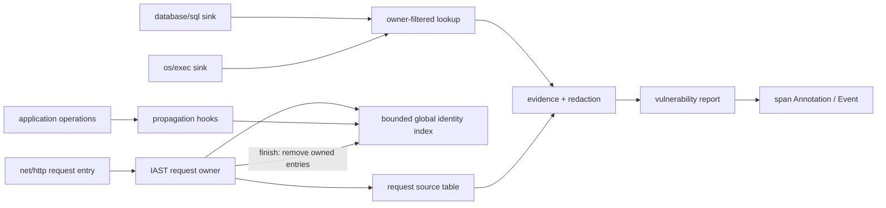
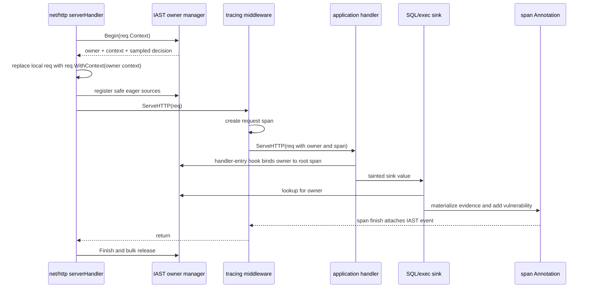

# Plan: Go taint tracking with `net/http`, SQL injection, and command injection

## Status

- **State:** proposed for review
- **Scope:** Interactive Application Security Testing (IAST) taint engine, Go standard-library HTTP sources, string and byte-slice propagation, `database/sql` SQL-injection sinks, and `os/exec` command-injection sinks
- **Target toolchain:** Go 1.26.6 and Orchestrion 1.12.2 initially
- **Removal:** delete this file after the implementation is complete and accepted; keep it only in change history

## 1. Objective

Implement request-scoped taint tracking without copying the runtime design of another tracer. Preserve the cross-language Datadog IAST semantics that are visible in traces:

- each tainted range has a source origin, source name, source value, and sink-specific secure marks that record which vulnerability types a sanitizer made safe;
- evidence identifies tainted and untainted value parts in sink order;
- evidence parts refer to a de-duplicated request-level `sources` array;
- sensitive source and evidence values are redacted before they leave the process;
- vulnerability hashes, locations, stack identifiers, quotas, de-duplication, and trace retention have stable meanings;
- all storage has a hard upper bound;
- pressure or contention drops IAST data instead of blocking or breaking the host application.

The Go implementation must use Go-specific mechanisms. In particular, Java object identity, .NET weak references, and JavaScript transaction-native taint objects do not transfer to Go.

## 2. Initial feature boundary

### 2.1 In scope

1. A bounded taint engine for `string` and `[]byte` values.
2. Byte-offset range algebra with source provenance and secure marks.
3. One IAST request lifetime for each incoming `net/http` request.
4. These initial HTTP origins:
   - URI;
   - path;
   - raw query;
   - header names and values;
   - cookie names and values;
   - query and form parameter names and values;
   - path parameter values exposed by `(*http.Request).PathValue`;
   - multipart parameter names and values;
   - raw request body values returned through an owned-result API such as `io.ReadAll`.

   Direct taint of caller-owned `Request.Body.Read` buffers is not in the first release because Go does not expose the allocation base or retained size of an arbitrary interior slice.
5. Propagation through:
   - string concatenation;
   - string and byte-slice slicing;
   - `string`/`[]byte` conversions;
   - the specific `strings`, `bytes`, `fmt`, `strconv`, and `net/url` operations in section 11;
   - the `strings.Builder`, `bytes.Buffer`, `append`, and `copy` cases in section 11 when their semantics can be preserved.
6. SQL-injection checks for query text executed through `database/sql`, including prepared-statement execution.
7. Command-injection checks when an `os/exec.Cmd` attempts to start a process.
8. Tainted evidence formatting, redaction, source indexing, process-level de-duplication, telemetry, unit tests, instrumented tests, race tests, and overhead benchmarks.

### 2.2 Not in the initial release

- HTTP framework-specific sources outside standard `net/http`.
- Tainting values decoded through `encoding/json`, `encoding/xml`, reflection, or third-party binders. Owned raw-body results can be tainted, but structured decoding needs separate propagation work.
- Direct taint of arbitrary caller-owned `io.Reader.Read` destination buffers.
- Raw body results larger than the finalized managed-root byte ceiling. The first release returns them unchanged and records a dropped body source.
- Database row sources. `OriginSqlRowValue` and `DD_IAST_DB_ROWS_TO_TAINT` already exist, but row taint is a later source integration.
- Sanitizer instrumentation. The range and reporting model supports secure marks now; specific sanitizer functions are later work.
- Other sink families such as server-side request forgery (SSRF), path traversal, cross-site scripting (XSS), Lightweight Directory Access Protocol (LDAP) injection, and NoSQL injection.
- Implicit goroutine-local request state. A goroutine must receive the request context or operate on an already-tainted value.
- Runtime hooks in `runtime.concatstrings` or other Go runtime internals.

## 3. Reference semantics

The reference implementations agree on the following externally visible contract even though their storage mechanisms differ.

| Concern | Required semantic |
|---|---|
| Source | Origin, optional name, and original source value are independent from the current transformed value. |
| Range | A value can contain ordered ranges from multiple sources. Marks apply per range and per vulnerability type. |
| Evidence | Untainted and tainted pieces occur in sink-value order. Tainted pieces refer to integer source indices. |
| Source indexing | Equal sources are de-duplicated by origin, name, and the full unredacted value. Redaction and truncation happen after de-duplication. |
| Sink suppression | A sink reports only if at least one relevant range is unsafe for that vulnerability type. |
| Quotas | Request sampling, concurrent-request capacity, per-request vulnerability capacity, and process-level de-duplication are separate controls. |
| Failure behavior | Missing context, unavailable capacity, internal errors, and unsupported propagation result in lost IAST data, not an application failure. |
| Redaction | Source-name and source-value rules combine with SQL- and command-specific evidence tokenization. |
| Location | Vulnerability hash and location do not depend on the attacker-controlled evidence value. |
| Trace retention | An accepted vulnerability keeps the trace. |

Primary reference files:

- Java:
  - `../dd-trace-java/dd-java-agent/agent-iast/src/main/java/com/datadog/iast/taint/TaintedMap.java`
  - `../dd-trace-java/dd-java-agent/agent-iast/src/main/java/com/datadog/iast/taint/Ranges.java`
  - `../dd-trace-java/dd-java-agent/agent-iast/src/main/java/com/datadog/iast/propagation/PropagationModuleImpl.java`
  - `../dd-trace-java/dd-java-agent/agent-iast/src/main/java/com/datadog/iast/propagation/StringModuleImpl.java`
  - `../dd-trace-java/dd-java-agent/agent-iast/src/main/java/com/datadog/iast/sink/SqlInjectionModuleImpl.java`
  - `../dd-trace-java/dd-java-agent/agent-iast/src/main/java/com/datadog/iast/sink/CommandInjectionModuleImpl.java`
  - `../dd-trace-java/dd-java-agent/agent-iast/src/main/java/com/datadog/iast/model/VulnerabilityBatch.java`
  - `../dd-trace-java/dd-java-agent/instrumentation/servlet/javax-servlet/javax-servlet-common/src/main/java/datadog/trace/instrumentation/servlet/http/HttpServletRequestInstrumentation.java`
- .NET:
  - `../dd-trace-dotnet/tracer/src/Datadog.Trace/Iast/DefaultTaintedMap.cs`
  - `../dd-trace-dotnet/tracer/src/Datadog.Trace/Iast/Ranges.cs`
  - `../dd-trace-dotnet/tracer/src/Datadog.Trace/Iast/IastRequestContext.cs`
  - `../dd-trace-dotnet/tracer/src/Datadog.Trace/Iast/IastModule.cs`
  - `../dd-trace-dotnet/tracer/src/Datadog.Trace/Iast/VulnerabilityBatch.cs`
  - `../dd-trace-dotnet/tracer/src/Datadog.Trace/Iast/SensitiveData/EvidenceRedactor.cs`
- JavaScript:
  - `../dd-trace-js/packages/dd-trace/src/appsec/iast/taint-tracking/operations.js`
  - `../dd-trace-js/packages/dd-trace/src/appsec/iast/taint-tracking/plugin.js`
  - `../dd-trace-js/packages/dd-trace/src/appsec/iast/analyzers/sql-injection-analyzer.js`
  - `../dd-trace-js/packages/dd-trace/src/appsec/iast/analyzers/command-injection-analyzer.js`
  - `../dd-trace-js/packages/dd-trace/src/appsec/iast/vulnerabilities-formatter/index.js`
  - `../dd-trace-js/packages/dd-trace/src/appsec/iast/vulnerability-reporter.js`
  - `../dd-trace-js/packages/dd-trace/src/appsec/iast/overhead-controller.js`

Do not copy these implementations mechanically. Use their tests and payload format as behavioral evidence.

## 4. Existing Go foundation and gaps

The repository already has:

- sampling and concurrent annotation capacity in `internal/spans/annotation.go`;
- event attachment and trace retention in `internal/spans/orchestrion.go`;
- vulnerability location and stack capture in `internal/vulnerability/report.go`;
- `Event`, `Source`, `Evidence`, `ValuePart`, `Location`, and `Vulnerability` wire models in `internal/model`;
- source and vulnerability enumerations in `internal/model/constants`;
- build-time and runtime IAST telemetry counters in `internal/instrumentation/telemetry`;
- all configuration names needed for basic taint reporting in `internal/config/config.go`;
- the Orchestrion `inject-declarations` and `go:linkname` pattern in `iast/crypto/*/orchestrion.yml`;
- an empty `taint` package and empty `taint/orchestrion.yml`.

The missing parts are:

- a request owner for taint data that can exist before an application trace span is created;
- bounded identity storage for strings and byte slices;
- range and secure-mark operations;
- HTTP source instrumentation;
- propagation instrumentation;
- tainted sink lookup;
- source de-duplication and evidence-value-part construction;
- SQL and command evidence redaction;
- bounded process-level vulnerability de-duplication;
- payload-size protection;
- end-to-end tests and overhead benchmarks.

## 5. Safety result: an address is not an identity

The initial hypothesis is directionally correct: the fast identity key should use the address of the data backing a string or byte slice. The address cannot be used alone.

### 5.1 Verified hazards

On Go 1.26.6:

- string data can be in read-only static memory, global small-value tables, a goroutine stack, or the heap;
- `net/textproto` interns common header names, and application literals can share their backing address;
- `strconv` can return small values from shared static storage;
- stack data moves and stack addresses are reused;
- allocator addresses are reused quickly after collection;
- `unsafe.StringData("")` can be `nil`;
- `unsafe.SliceData` for a zero-capacity slice returns an unspecified address;
- `weak.Make(unsafe.StringData(value))` can terminate the process with a runtime `throw` for non-heap pointers;
- `runtime.AddCleanup` on such a pointer can panic;
- both weak handles and cleanup registration can force values to escape;
- a `uintptr` does not keep an allocation alive and does not prevent address reuse;
- a short substring can be an interior pointer into a much larger allocation, so charging only `len(substring)` does not bound retained memory.

Verify these claims against the installed Go sources before each supported toolchain update. The relevant Go 1.26.6 files are `src/unsafe/unsafe.go`, `src/weak/pointer.go`, `src/runtime/mheap.go`, `src/runtime/mcleanup.go`, `src/runtime/string.go`, and `src/net/textproto/reader.go`.

Therefore the implementation must never call `weak.Make` or `runtime.AddCleanup` on string or slice data pointers. A process-global `uintptr`-only map is rejected. A strong anchor to an arbitrary application value is also rejected because the value can use shared static storage or retain an unknown larger allocation.

### 5.2 Chosen identity: managed backing allocations

Only a **managed tainted value** can enter the identity index. The public source operation returns a replacement value:

```text
managed = TaintString(owner, source, original) // returns a string
managed = TaintBytes(owner, source, original)  // returns a []byte
```

The source hook must install the returned value in the application-visible field, map, slice, or function result. `TaintString` clones the source into unique backing storage before it records taint. `TaintBytes` also returns owned backing storage; it is valid only where replacing the result preserves the API contract. This copy-on-taint rule prevents an interned header name or small formatted value from tainting an unrelated equal literal.

A stored value still uses its data address and byte length for fast lookup, but its entry refers to a request-owned **root anchor**. The engine creates or adopts a root anchor only when it knows the complete allocation and can charge it once. A slice or substring propagation entry refers to its parent's root anchor and does not create or charge a second anchor. If an operation returns a value outside every input root, the propagation hook clones the result before returning it unless an operation-specific audit proves that the result starts at a complete new allocation. Audited allocating operations such as multi-input string concatenation, `strings.Join`, and reallocating `append` can adopt the result directly and charge its conservative allocation size. Fast paths that return an input reuse that input's root. Operations that can return static storage, such as small-value formatting, must clone. An in-place `append` keeps the existing root. Cloning an `append` result is prohibited because it changes capacity and aliasing.

This produces two key forms:

```text
root:    (root address, root size, owner) -> strong managed anchor
value:   (value address, value length, kind, owner) -> root anchor + ranges
```

The implementation must not adopt an arbitrary interior pointer as a new root. If it cannot prove or create a complete managed root without changing API semantics, it drops taint.

Empty and one-byte values are not tracked in the first version. Cloning can make them unique, but excluding them keeps static-small-value behavior out of the initial unsafe-adjacent implementation.

Managed retention is acceptable only with all of these hard limits:

- maximum active request owners, with a hard process ceiling independent of configuration;
- maximum root anchors and value entries per request;
- maximum charged root bytes per request;
- maximum root anchors, value entries, and charged root bytes process-wide;
- maximum bytes for one managed root;
- maximum object bindings and sources per request;
- maximum ranges per value with a non-configurable hard ceiling;
- synchronous anchor release at request completion;
- drop-new behavior when any limit is reached.

Phase 0 prototypes and benchmarks set the exact constants. Initial measurements evaluate these provisional ceilings rather than treating them as API contracts:

- at most 64 active owners process-wide; clamp `DD_IAST_MAX_CONCURRENT_REQUESTS` to this internal safety ceiling, and treat `0` as no IAST owner acquisition;
- 4,096 value entries and 2 MiB of charged roots per request;
- 16,384 value entries and 8 MiB of charged roots process-wide;
- 64 KiB for one managed root;
- 256 object bindings and 256 sources per request;
- configured range count capped at a hard maximum of 64.

Charge each root by a conservative allocation-size class, not only its logical length. For a managed slice, include capacity. For a managed string clone, round the requested size up conservatively. Phase 0 must prove with `runtime.MemStats` that many substrings of a large parent charge and retain one bounded root, not one short value per substring.

Do not compute any limit only as `MaxConcurrentRequests × value` because `DD_IAST_MAX_CONCURRENT_REQUESTS` currently accepts very large values.

## 6. Architecture



### 6.1 Package layout

The exact exported API is subject to implementation review, but package responsibilities must remain separated.

| Path | Responsibility |
|---|---|
| `taint/` | Public, low-level taint and propagation API. It must be usable by future external source, propagation, sanitizer, and sink integrations. |
| `internal/taint/ranges/` | Pure range algebra and secure-mark bitsets. No global state and no instrumentation dependencies. |
| `internal/taint/store/` | Bounded owner-tagged root anchors, value index, and object bindings for request URL/body attribution. |
| `internal/taint/request/` | Request owner, source table, quotas, active lifetime, context carrier, span binding, and owned-entry handles. |
| `internal/taint/evidence/` | Convert sink ranges to `model.ValuePart` and request sources to `model.Source`. |
| `internal/taint/redaction/` | Source redaction plus SQL and command evidence tokenization. |
| `internal/dedup/` | Fixed-capacity, time-bounded process-level vulnerability de-duplication. |
| `iast/sources/http/` | Standard `net/http` source hooks and its `orchestrion.yml`. |
| `iast/injection/sql/` | `database/sql` sink hooks and reporting wrapper. |
| `iast/injection/command/` | `os/exec` sink hooks and reporting wrapper. |

`orchestrion.tool.go` must import every new package that contains an `orchestrion.yml` file. `README.md` must list the SQL-injection and command-injection packages and the supported source/propagation limitations.

### 6.2 Request owner and global index

A propagation operation usually has no `context.Context`. A request-only map cannot support `strings.Join`, `a + b`, or builder operations. The index must be globally reachable, but every root anchor, value entry, and object binding remains owned by one active IAST request.

The value index maps one managed value key to a bounded set of owner-specific entries:

```text
(ptr, len, kind) -> [(owner A, root A, ranges), (owner B, root B, ranges), ...]
```

The owner set supports explicit shared managed backing. Lookup without a context returns owner-separated taint. A propagation operation creates a result entry independently for each contributing owner. A sink with a request context accepts only its owner. A sink without a context accepts a match only when the **matched value entries** resolve to one active owner that is bound to a trace span.

A separate, bounded object-binding table associates a request's `*url.URL` and supported body reader objects with the owner. These are ordinary heap objects, so owner-held strong references or weak pointers are safe choices after Phase 0 measures them. Object bindings use their own count limit and are removed with the owner.

Each owner records bounded slot handles. `Finish` first atomically changes the owner to a terminal state, which rejects all later writes. It then clears anchor and entry slots synchronously and changes each empty index bucket to a reusable tombstone. Inserts reuse tombstones, so stale keys cannot permanently saturate the fixed table. Cleanup must not be a droppable `TryLock` write. Prefer generation-tagged preallocated slots whose anchor pointer can be atomically replaced with `nil`; stale index references contain no strong anchor and fail owner-generation validation. If the implementation uses locks instead, Phase 0 must prove a bounded cleanup path and an opportunistic dead-owner scavenger. A failed fast-path cleanup is never allowed to retain an anchor indefinitely.

Use fixed-capacity, sharded open-addressing tables. Read and ordinary write critical sections have bounded work. Ordinary propagation can use `TryRLock`/`TryLock`; contention is a taint miss or dropped write. Cleanup has the stronger rule above. The production path must not resize a map, allocate a collision chain, retry indefinitely, or create an entry after its owner starts closing.

### 6.3 Entry and range shape

A conceptual entry is:

```go
type entry struct {
    ownerID uint64
    kind    valueKind // string or bytes
    rootID  uint32    // request-owned, fully charged managed backing
    ranges  boundedRanges
}

type Range struct {
    Start    uint32 // byte offset
    Length   uint32
    SourceID uint16 // request-local source table index
    Marks    uint64 // bit position is the constants.VulnerabilityType numeric value
}
```

This is not a required literal definition. The implementation can use parallel arrays or inline storage after measurement.

Invariants:

1. `Length > 0`.
2. `Start + Length <= value byte length`, with checked arithmetic.
3. Ranges are sorted by `Start`.
4. Evidence-facing ranges do not overlap. If two source operations cover the same bytes, first provenance wins and later ranges are clipped or dropped deterministically.
5. Range count never exceeds the effective configured limit or the hard limit.
6. Source identifiers are valid for the entry owner.
7. Marks are intersected when a coarse operation combines bytes with different protection. This is a Go safety decision: a union could invent protection and hide a vulnerability. Reference tracers do not expose one consistent coarse-mark rule.
8. `Marks` uses the numeric `constants.VulnerabilityType` value as its bit position; it does not define a separate SQL/CMD ordering. A compile-time assertion fails if `constants.VulnerabilityTypeCount` exceeds the mark bit width.
9. Any invariant failure drops the result. It must not panic in production.

### 6.4 Byte slices and mutation

`[]byte` support is required, but only managed byte roots are sound:

- retaining an arbitrary interior slice can keep an unknown larger allocation alive;
- retaining a slice can change escape behavior;
- in-place mutation keeps the address and can invalidate provenance;
- overlapping subslices have different start addresses, so a generation keyed only by one slice start is incorrect;
- `append` can keep or replace the backing array;
- arbitrary index assignments are not visible to Orchestrion 1.12.2.

The initial byte API therefore clones and returns a managed slice, or adopts a complete result whose start and capacity are known, such as an instrumented allocation result. Subslice entries reference that managed root. An instrumented write increments the root generation in O(1) before it installs new ranges. Each value entry records the generation at creation and is valid only when it equals the root generation. Reclaim stale entries opportunistically with bounded work; do not sweep every value for the root on each write. Set a per-root value-entry limit so stale entries cannot consume the complete request table.

Do not taint an arbitrary caller-owned `Read(p)` destination because the engine cannot determine the allocation base or retained size of an interior `p`. Support owned results such as an instrumented `io.ReadAll` return first. Direct read-buffer support requires a later mechanism that proves the complete allocation and instruments all relevant writes.

Do not read or hash byte contents to detect mutation. Such reads add cost, can produce race-detector reports, and do not solve address reuse reliably.

## 7. Request and span lifecycle

A standard HTTP request can enter user middleware before a Datadog span is present. Sampling and capacity ownership cannot depend only on `tracer.SpanFromContext` at `net/http.serverHandler.ServeHTTP` entry.



Required behavior:

1. A hook on `net/http.serverHandler.ServeHTTP` in Go 1.26.6 `src/net/http/server.go` starts or reuses an IAST owner, applies sampling, acquires capacity without waiting, installs the owner in a derived request context, registers fields that are safe to read, and defers owner completion.
2. A second function-body aspect matches handler-like functions with `http.ResponseWriter` and `*http.Request` arguments. It is a cheap no-op unless the request has an active owner. When a trace span is present, it binds the owner to the root span and its `spans.Annotation` exactly once. Also bind in `tracer.StartSpanFromContext` when its parent context carries an owner; this removes ordering dependence on the next handler layer.
3. Nested middleware does not create nested IAST owners. Only the hook that created the owner closes it.
4. The outermost instrumented handler creates and closes an owner whenever its request context has no active owner. This covers direct calls, HTTP/2 over cleartext (h2c), and custom HTTP dispatch paths that bypass `net/http.serverHandler.ServeHTTP`. An in-process re-dispatch that creates a fresh request with a fresh context intentionally creates a separate owner and consumes a separate permit; document and test this boundary.
5. Refactor sampling and capacity before source work. The `serverHandler.ServeHTTP` hook, or outermost-handler fallback, eagerly creates the analysis before user code runs. One analysis object owns the permit and decision. `AnnotationFor` becomes lookup-or-adopt: it uses the owner analysis when one is in scope and creates a fallback only for a span with no HTTP owner. `tracer.StartSpanFromContext` binds the existing owner analysis before a sink can create a competing annotation. If an annotation already exists, owner binding adopts that same analysis and never changes its decision or `_dd.iast.enabled` value. Add deterministic repeated tests for a weak-hash finding before normal handler binding.
6. The bound root span receives `_dd.iast.enabled=1` for an acquired sampled owner and `0` for a sampled-out or capacity-dropped owner when a span becomes available. This follows current Go documentation and .NET behavior; Java and JavaScript do not emit `0` symmetrically.
7. A tainted sink with no context can use an owner only when the matched taint entries resolve to exactly one active owner and that owner is bound to a span. The number of unrelated active owners is not the ambiguity test. Ambiguous or unbound matches are dropped. It must not create an orphan vulnerability from address evidence alone.
8. Evidence and source models are fully copied into `model.Event` before the owner finishes. The event must never read the taint store during span serialization.
9. Owner completion is idempotent. Panic unwinding through a handler still runs cleanup.

An instrumented test must verify the handler-signature aspect and its ordering relative to tracing middleware before the remaining HTTP source work starts. Give owner creation/binding advice an explicit Orchestrion `namespace` and `order`; unnamespaced prepend advice runs last. The current dd-trace-go configuration has no competing generic handler-body aspect, but this test protects future changes.

## 8. Range operations

The core API must provide small, reusable operations rather than sink-specific range math.

### 8.1 Exact operations

- **Copy:** copy ranges unchanged to a distinct value.
- **Shift:** add a checked byte offset.
- **Concat:** retain left ranges and shift right ranges by `len(left)`.
- **Slice:** intersect each range with `[low, high)`, clip it, and shift by `-low`.
- **Join:** concatenate element ranges and separator ranges at their output offsets.
- **Repeat:** repeat and shift input ranges for each copy until the range limit is reached.
- **Replace:** preserve exact ranges when the implementation can map each copied segment and replacement.
- **Write/append:** shift source ranges to the destination write offset and preserve existing destination ranges that were not overwritten.
- **Mark:** add one vulnerability-specific mark to selected ranges.
- **UnsafeFor:** remove ranges marked safe for the requested vulnerability type.

### 8.2 Coarse operation

For a transformation where output character positions cannot be mapped at acceptable cost:

- taint the whole output;
- use the first contributing source in deterministic input and range order;
- use the intersection of marks from contributing ranges;
- increment a coarsening telemetry counter.

This is a Go-specific conservative rule for operations that cannot preserve positions cheaply. It follows the reference tracers' general use of coarse fallback ranges but does not claim one shared cross-language mark-combination rule. It must not fabricate several overlapping whole-output ranges.

### 8.3 Range limit

When an operation produces more than the limit, keep the earliest ranges in output order and drop the tail. This is deterministic, preserves the evidence prefix, and matches the verified Java left-biased behavior; verify .NET and JavaScript before claiming broader parity. Increment a dropped-range counter.

Offsets are bytes because Go string and slice operations use byte indices. Tests must include UTF-8, invalid UTF-8, and slices that start or end inside a multi-byte encoding. Range code must not use rune counts for identity or propagation. Existing model truncation continues to count Unicode characters at the reporting boundary.

## 9. Orchestrion capability and prerequisite work

The schema at `https://datadoghq.dev/orchestrion/schema.json` and Orchestrion 1.12.2 support named function calls, method calls, function bodies, declarations, values, structs, and expression wrapping. They do not provide join points for:

- `BinaryExpr` string `+`;
- `SliceExpr`;
- built-in conversions such as `string(b)` and `[]byte(s)`;
- built-ins such as `append` and `copy` with reliable shadowing-safe matching;
- indirect calls through a function variable.

Address-based storage does not repair these missing propagation points.

### 9.1 Required Orchestrion extension

Open a separate Orchestrion change that adds typed join points for:

1. a maximal typed string-concatenation chain, not each nested binary node;
2. string and byte-slice slicing, including full slice expressions;
3. conversions between string-like and byte-slice-like types;
4. built-in `append` and `copy`;
5. byte index and slice assignment, if it can be implemented without rewriting unrelated assignments.

The matcher must use `go/types`, not syntax text, so it handles aliases and defined types without matching numeric addition or a shadowed function named `append`. Template proxies must expose operands and bounds. Existing `wrap-expression` advice can then call typed propagation helpers.

Semantic requirements for each rewrite:

- capture the maximal `a + b + c` chain and compile one helper wrapper, so Go can retain one concatenation allocation instead of allocating each nested prefix;
- use generated fixed-arity helpers for common chain sizes (at least 2 through 8); put any variadic fallback behind the active-owner branch so disabled/no-owner paths do not build an escaping operand slice;
- verify the helper shape with `go build -gcflags=-m` and allocation benchmarks in Phase 0 before finalizing the upstream schema;
- evaluate every operand exactly once;
- preserve left-to-right evaluation;
- preserve return type, including defined string and slice types;
- preserve panic and bounds-check behavior;
- do not recover a host panic;
- exclude all `dd-iast-go` taint implementation packages from their own aspects;
- add compile fixtures for generic types, defined types, omitted slice bounds, full slices, variadic append, and shadowed built-ins;
- benchmark disabled, unsampled, untainted, and tainted paths.

Do not instrument Go runtime concatenation helpers. A hook there affects every string concatenation, runs during runtime-sensitive paths, creates linking and initialization risks, and cannot meet the host-safety requirement.

The dd-iast-go implementation can develop named-function propagation in parallel, but the initial feature is not complete until concatenation, slicing, and string/byte conversion aspects are available. `append`, `copy`, and arbitrary byte mutation can follow behind an explicit coverage flag if their rewrite cost is too high.

### 9.2 Aspect patterns

Use two distinct patterns.

**HTTP sources and sinks inside standard-library implementations:** a standard-library package cannot import `dd-iast-go` normally. Match the exact function body, inject one `//go:linkname` declaration per affected source file, add the target package to `links`, and call a nil-safe helper. Avoid duplicate declarations when several functions share one file.

**Named propagation operations such as `strings.Join`:** instrument function and method **call sites**, not the standard-library function definition. A call-site `wrap-expression` can be excluded from `dd-iast-go` and `dd-trace-go` packages and avoids recursive hooks when the taint engine itself uses `strings`, formatting, logging, or redaction. The wrapper captures receiver and arguments once, evaluates the original call once, then propagates to a managed result. Indirect calls remain a documented gap.

Both patterns use a cheap active-owner gate and increment build-time telemetry only for matched aspects. Add an import audit and an instrumented recursion test, but do not claim package filters can exclude callers from a function-body aspect.

Every unexported standard-library function boundary is version-sensitive. An instrumented compile test must fail if an expected source or sink aspect no longer matches after a Go update.

## 10. HTTP sources

### 10.1 Eager sources at request entry

Reading these fields does not parse a form or consume a body:

| Data | Origin | Name |
|---|---|---|
| `Request.RequestURI` | `http.request.uri` | empty |
| `Request.URL.Path` | `http.request.path` | empty |
| `Request.URL.RawQuery` | `http.request.query` | empty |
| each `Request.Header` key | `http.request.header.name` | header name |
| each string in `Request.Header[key]` | `http.request.header` | header name |

Guard nil request and URL values. Do not call `ParseForm`, `ParseMultipartForm`, or read `Body` at entry.

Clone each sampled source into managed backing and replace the request-visible value. Rebuild the header map with cloned keys and clone every header value before recording it. Go's `net/textproto` interns common header keys, so recording an original key address would taint an unrelated equal literal in the same request.

Bind `Request.URL` to the owner in the bounded object-binding table so later `(*url.URL).Query` instrumentation can attribute parsed query names and values. Clone and replace each lazy parsed name/value or returned source before recording it. Before cloning, query the source table by full `(origin, name, value)`. Reuse and return its existing managed clone on a hit. Repeated `URL.Query`, cookie, form, and `PathValue` calls therefore keep root and value-entry counts constant.

Admit sources by priority so eager header names cannot consume all source slots before parameter and body sources. Phase 0 defines that order and records drops by origin.

For server requests, `Request.RequestURI` is the request-target, not a full absolute URL. The initial Go source uses that application-visible value for `http.request.uri`. Document this Go-specific divergence and confirm backend acceptance; reconstructing a synthetic full URL would not taint the value the application actually reads.

### 10.2 Lazy sources

Use deferred function-body hooks after successful standard-library parsing:

| API/boundary | Output |
|---|---|
| `(*url.URL).Query` for an owner-bound request URL | query parameter names and each value |
| `(*http.Request).ParseForm` and its internal post-form path | `Form` and `PostForm` names and values |
| `(*http.Request).FormValue` / `PostFormValue` | returned value, as a fallback when parser internals change |
| `(*http.Request).Cookie`, `Cookies`, and `CookiesNamed` | cookie names and values |
| `(*http.Request).PathValue` | returned path parameter value, named by the requested key |
| `(*http.Request).ParseMultipartForm` | value-part names and values; file contents are not initial parameter sources |

Hooks must be idempotent. Repeated calls must not create duplicate sources or replace earlier provenance for the same bytes.

### 10.3 Body bytes

Do not eagerly consume the body and do not replace its concrete type in the first version. Bind the body object to the owner, then instrument APIs that return an owned result, starting with `io.ReadAll`. If the input reader is an owner-bound request body, clone the returned `[]byte` to a complete managed root, taint it as `http.request.body`, and replace the function result.

This preserves read counts, errors, close behavior, optional interfaces, and caller-buffer ownership. `io.ReadAll` uses the call-site aspect pattern from section 9.2 with `dd-iast-go` and `dd-trace-go` exclusions. It covers the common raw-body path but not direct `Request.Body.Read(p)` calls. Document that limitation.

Apply the managed-root ceiling to the complete returned body. In the initial release, a body result larger than the final Phase 0 root limit is returned unchanged and untainted, and a dropped-body-source counter is recorded. Do not claim prefix taint because a prefix clone would not back the application result. Document the exact byte threshold and test one byte below, at, and above it. Add separate later design work for direct reads only if it can prove the complete destination allocation and invalidate all overlapping mutations.

Tests still cover HTTP/1, HTTP/2, h2c, `http.NoBody`, middleware replacing `Request.Body`, EOF-with-data, read errors, and no extra reads. Body support does not imply propagation through JSON or XML decoding.

## 11. Propagation inventory

The first implementation must publish an explicit matrix in tests and README. Do not claim generic propagation.

| Operation | Initial precision | Instrumentation |
|---|---|---|
| `a + b` for string-like values | exact | required Orchestrion typed binary-expression join point |
| `s[low:high]`, `b[low:high:max]` | exact | required typed slice-expression join point |
| `string(b)`, `[]byte(s)` | exact range copy to new backing | required typed conversion join point |
| `strings.Clone` | exact | call-site wrapper |
| `strings.Join` | exact | call-site wrapper |
| `strings.Repeat` | exact until range limit | call-site wrapper |
| `strings.Cut`, `Split*`, `Fields*` | exact; compute output offsets relative to the managed input root | call-site wrapper |
| `strings.Trim*` | exact; compute output offset relative to the managed input root | call-site wrapper |
| `strings.Replace*`, `Replacer.Replace` | exact while the number of mapped copied/replacement segments fits the range/work limit; otherwise coarse | call-site wrapper |
| `strings.ToLower`, `ToUpper`, `Map`, `ToValidUTF8` | exact only when byte positions remain valid; otherwise coarse | call-site wrapper |
| `fmt.Sprint`, `Sprintf`, `Sprintln` | coarse from first tainted contributing argument | call-site wrapper |
| `net/url.QueryEscape`, `PathEscape`, `QueryUnescape`, `PathUnescape` | coarse initially | call-site wrapper |
| `strconv.Quote`, `QuoteToASCII`, `QuoteToGraphic`, `Unquote` | coarse initially | call-site wrapper |
| `strings.Builder` writes and `String` | exact through bounded builder state; clone a tainted `String` result to a managed root | call-site method wrappers |
| `bytes.Buffer` writes and `String`/`Bytes` | exact only after the full buffer root and capacity can be charged without changing alias semantics | call-site method wrappers |
| `append` | exact for retained source ranges; re-key if backing changes | required typed built-in join point |
| `copy` | exact overwrite and O(1) root-generation invalidation | required typed built-in join point |
| `io.ReadAll` on an owner-bound request body | exact whole-result body source within the managed-root limit | call-site wrapper with `dd-iast-go`/`dd-trace-go` exclusions |
| indirect function calls | not covered | documented limitation |
| arbitrary `b[i] = x` | invalidates precision unless assignment join point lands | documented limitation plus telemetry when detectable |

Each propagation entry point starts with a single cheap active-owner check. Untainted lookup must not allocate. A tainted result write can allocate only within pre-allocated or strictly bounded storage.

Do not instrument `fmt.Fprintf` as string propagation until writer identity and offset semantics exist. It returns a byte count, not the produced string.

## 12. SQL-injection sink

### 12.1 Boundaries

Report at execution, matching .NET and JavaScript. Java also reports when `Connection.prepareStatement` or `prepareCall` receives a query. Go deliberately does not report on preparation because `database/sql` later executes the same fixed statement and a prepare-time report would create another location/hash for one query. Document this Java divergence.

Use stable exported execution methods above `database/sql` retry loops:

- `(*DB).ExecContext` and `(*DB).QueryContext` (the non-context and `QueryRow` variants delegate to them);
- `(*Tx).ExecContext` and `(*Tx).QueryContext`;
- `(*Conn).ExecContext` and `(*Conn).QueryContext`;
- `(*Stmt).ExecContext` and `(*Stmt).QueryContext`, using the statement's stored query text from inside the package.

Implement all eight boundaries as `function-body` aspects in Go 1.26.6 `src/database/sql/sql.go`, with `go:linkname` helpers. Function-body instrumentation gives the Stmt hooks access to the private `query` field; DB, Tx, and Conn use their query parameter. It also runs once above the retry loop. Anchor each injected linkname declaration on exactly one matched function per source file to avoid redeclaration, following `iast/crypto/hash/orchestrion.yml`.

This has more aspects than `execDC`/`queryDC`, but it avoids reporting once per `driver.ErrBadConn` retry and covers prepared-statement execution at the execution location. Exact-once tests must cover all receiver types, context and non-context wrappers, `QueryRow`, retries, and statements. If Go changes a delegation path, the build-time telemetry count and integration matrix must fail.

### 12.2 Detection

1. Look up the query string.
2. Select the request owner from the passed context. If the non-context exported API supplied a background context, accept only one unambiguous active owner with a bound span.
3. Remove ranges marked secure for `SQL_INJECTION`.
4. If no unsafe range remains, increment `suppressed.vulnerabilities` and return.
5. Build evidence from the query and unsafe ranges.
6. Report one `SQL_INJECTION` vulnerability at the application call site. Location selection must skip all contiguous `dd-iast-go`, `dd-trace-go`, and `database/sql` frames with a bounded predicate, not only one exact frame.

Parameterized query arguments are not part of the SQL query evidence and must not cause a report. Taint in an argument passed separately to the driver is safe for this sink.

## 13. Command-injection sink

`exec.Command` and `exec.CommandContext` only build a `Cmd`. Reporting there creates false positives for commands that never run.

For Go 1.26.6, instrument the `os.StartProcess` call in `src/os/exec/exec.go` inside `(*exec.Cmd).Start`, after `Cmd.Start` has completed validation and path resolution. `Run`, `Output`, and `CombinedOutput` all converge on `Start`. Restrict the join point with `import-path: os/exec` so a template that references `Cmd` locals cannot match unrelated direct uses of `os.StartProcess`.

Detection:

1. Capture the actual `argv` expression passed to `os.StartProcess` exactly once. It is non-empty even for a hand-built `Cmd` whose `Args` is empty. Preserve `argv[0]` as the command supplied by the application; use the resolved path only as supporting context if needed.
2. Look up every argument separately.
3. Select the owner from `Cmd` context when available. For `exec.Command`, accept only one unambiguous active owner with a bound span.
4. Remove ranges marked secure for `COMMAND_INJECTION`.
5. If no unsafe range remains, increment suppression telemetry and return.
6. Build one evidence string by joining command and arguments with one untainted ASCII space. Shift each argument range to its evidence offset.
7. Report once for each real process-start attempt, including an attempt where the operating system returns an error. Location selection skips contiguous `dd-iast-go`, `dd-trace-go`, `os/exec`, and `os` frames with a bounded predicate so `Start`, `Run`, `Output`, and `CombinedOutput` identify the application caller.

Phase 0 must verify the exact process-creation call in the installed target source before writing the aspect. If a later Go release no longer contains a direct `os.StartProcess` call, its expected-aspect test fails and that release remains unsupported until a new post-validation boundary is reviewed; do not fall back to reporting at `Cmd.Start` entry.

The injected wrapper must bind every original `os.StartProcess` argument once, report from the bound `argv`, invoke the original call once, and preserve its result and error without recovery or translation. Anchor its linkname declaration once in the file.

## 14. Evidence, sources, redaction, and report assembly

### 14.1 Source table

A request owner maintains a bounded source table and a de-duplication index. Source equality is:

```text
(origin, name, full unredacted value)
```

The source record refers to its bounded managed root while the owner is active, so it can compare the full immutable value without a second unbounded copy. The per-root size ceiling bounds this comparison. Apply truncation only when materializing `model.Source`. Source IDs used by ranges are request-local and stable until owner completion.

At report assembly, apply configured name and value patterns. A redacted model uses `pattern` plus `redacted:true` and omits `value`, as the existing `model.Source` supports.

Only sources referenced by accepted vulnerability evidence need to be materialized into `Event.Sources`. Maintain an owner-source-ID to event-source-index mapping so several vulnerabilities reuse one event source.

### 14.2 Evidence parts

Walk unsafe ranges in byte order and emit alternating untainted and tainted `model.ValuePart` values. Preserve other vulnerability marks in `secure_marks`; the current sink's secure mark has already removed that range.

Required properties:

- parts cover the represented evidence without gaps or reordering before truncation/redaction;
- tainted parts have a valid source index;
- untainted parts have no source index;
- no empty part is emitted before configured truncation; `DD_IAST_TRUNCATION_MAX_VALUE=0` can intentionally produce empty serialized values;
- source indices refer to the final `Event.Sources` order;
- model truncation is applied only after range partitioning, with an explicit running evidence budget so many individually truncated parts cannot bypass the event limit;
- invalid UTF-8 cannot panic the formatter.

### 14.3 Redaction

Apply redaction at report assembly, not in the taint hot path.

- Source redaction uses `DD_IAST_REDACTION_NAME_PATTERN` and `DD_IAST_REDACTION_VALUE_PATTERN`.
- SQL evidence uses a bounded tokenizer. Evaluate the already-present indirect `github.com/DataDog/go-sqllexer` dependency and a bounded regular-expression tokenizer against the shared reference redaction corpus before choosing it. Java and .NET use regular-expression tokenizers, so a lexer is a Go-specific implementation choice and must match their observable redaction boundaries.
- Command evidence preserves the executable position and redacts argument values, option values, and tainted parts whose source name or value matches the configured sensitive-data pattern, according to the shared corpus semantics.
- If redaction fails or reaches a complexity limit, redact the affected evidence conservatively. Do not fall back to emitting a raw secret.
- Go regular expressions use the RE2 engine and do not need the .NET catastrophic-backtracking timeout mechanism, but input and output lengths still require hard limits.

### 14.4 Vulnerability reporting and de-duplication

Add a tainted-evidence reporting path beside the current plain-string `vulnerability.Report`; do not make weak hash/cipher reporting pay taint lookup cost.

De-duplication has two layers:

1. existing per-request hash de-duplication and vulnerability count in `model.Event`;
2. a process-level fixed-capacity set of 1,000 vulnerability hashes that clears after one hour or when full. This matches Java and .NET; JavaScript instead uses least-recently-used (LRU) eviction. Use clear-all initially because it is simpler and bounded, and document the JavaScript divergence.

The process-level set must not grow. A dropped de-dup check under lock contention is a Go-specific host-safety choice, not cross-language parity; count it in debug telemetry. Preserve `model.NewVulnerability` hashing for SQL and command findings: Go's type + path + line scheme matches Java and JavaScript, while .NET uses type + class + method. Do not change existing hashes as part of taint tracking.

Extend location selection in `internal/vulnerability/report.go`. The current `SkipFrame` can omit only one exact frame, but SQL and command hooks have several standard-library and instrumentation frames. Add a bounded `SkipWhile` predicate over package namespaces. For SQL, it skips contiguous `dd-iast-go`, `dd-trace-go`, and `database/sql` frames. For commands, it skips contiguous `dd-iast-go`, `dd-trace-go`, `os/exec`, and `os` frames. It then uses the first application frame. Location discovery always captures this bounded minimum depth, even when `DD_IAST_STACK_TRACE_ENABLED=false`; that setting controls whether the full stack is recorded, not whether enough frames are inspected to find a stable location. Discard extra frames when stack reporting is off. If the scan reaches its hard depth without an application frame, report a location without path/line rather than scanning without a bound.

`internal/spans/orchestrion.go` already applies `ext.ManualKeep` and prefers the `iast` meta-structure. Preserve that behavior. Keep Go's current per-vulnerability universally unique identifier (UUID) stack IDs and document them as a Go wire-compatible correlation choice; the reference tracers use different ID-generation schemes.

### 14.5 Payload-size bound

Before setting a meta-structure or JSON tag, enforce a 25,000-byte encoded-event ceiling. Java uses this limit with UTF-8 and the sentinel `MAX_SIZE_EXCEEDED`; .NET counts UTF-16 bytes and uses `MAX SIZE EXCEEDED`; JavaScript has no equivalent formatter rule. Confirm the backend contract in Phase 0. Unless the backend requires another form, use the Java UTF-8 rule and record the divergence.

If the complete event exceeds the limit:

- build a separate truncated `model.Event`; do not mutate `Annotation.Event` while `spans.Finished` holds its read lock;
- preserve each vulnerability's type, hash, and location;
- replace detailed evidence with `MAX_SIZE_EXCEEDED`;
- omit sources;
- set the appropriate truncation indicator tag if the Go tracer exposes it.

Measure actual `MarshalMsg` and JSON output lengths. `Msgsize` is only an upper bound. Add boundary tests at 24,999, 25,000, and 25,001 encoded bytes.

## 15. Telemetry and capacity behavior

Reuse existing metrics:

- `instrumented.source` by origin;
- `instrumented.propagation`;
- `instrumented.sink` by vulnerability type;
- `executed.source`;
- `executed.propagation` at debug verbosity;
- `executed.sink`;
- `executed.tainted`;
- `request.tainted`.

Add bounded-loss visibility:

- values dropped because entry capacity is full;
- values dropped because retained-byte capacity is full;
- sources dropped;
- ranges dropped;
- writes dropped due to shard contention;
- coarse propagations;
- suppressed vulnerabilities.

Use existing telemetry naming conventions after confirming which of these names are accepted by the common IAST telemetry specification. Do not emit unsupported metric names only because they are useful locally; unsupported details can first use debug telemetry logs with rate limiting.

Every source, propagation, and sink hook has this order:

1. global IAST enabled and active-owner gate;
2. cheap value eligibility and untainted lookup;
3. telemetry increment required at this verbosity;
4. expensive range, redaction, stack, or report work.

## 16. Implementation phases

Each phase is independently reviewable. Do not combine the unsafe-adjacent store, source instrumentation, and sink reporting in one change.

### Phase 0 — prove hard assumptions

1. Add scratch or test-only probes for stack/static/heap strings, interned header names and small formatted values, allocator address reuse, string and byte-slice escape behavior, managed cloning, root sharing for substrings, anchor release, and fixed-arity maximal-concat helper shapes. Use escape-analysis output and allocation benchmarks before proposing the Orchestrion concat schema.
2. Prototype the fixed-capacity managed-root store and measure entry size, actual retained heap for large-parent substrings, lock contention, terminal-owner cleanup, late-write rejection, and disabled/unsampled cost.
3. Prove HTTP owner creation, nested handler behavior, tracing-middleware span binding, and cleanup ordering with Orchestrion.
4. Prove HTTP/1, HTTP/2, and h2c owner binding plus owned `io.ReadAll` body attribution without changing application-observable behavior.
5. Validate SQL and command redaction output against reference fixtures.
6. Fix final hard capacities from measured results and record the calculation in code comments and benchmarks.

**Exit:** source and propagation fuzz/property suites complete with zero panics or runtime throws for their configured corpus; no taint hit from an interned source against an unrelated equal literal; large-parent substring retention stays within the charged root budget; one owner, one sampling decision, and one permit per request; owned-body support and its size boundary work; the disabled/no-owner, unsampled, sampled-source, untainted named-operation, and hand-written fixed-arity concat prototype gates in section 18.4 pass. The full expression-aspect gate remains a Phase 6 exit.

### Phase 1 — range algebra and request source model

Implement pure range operations, secure marks, bounded source table, deterministic clipping, and property/fuzz tests. No instrumentation and no global unsafe state.

**Exit:** all range invariants, UTF-8/invalid-UTF-8 cases, range-limit behavior, and mark-intersection behavior pass.

### Phase 2 — bounded identity store

Implement owner-tagged managed roots, value shards, bounded object bindings, string and byte keys, root-level mutation invalidation, hard entry/byte limits, contention drops, terminal-owner late-write rejection, synchronous anchor cleanup, and store telemetry. Refactor request owner acquisition so one analysis object owns the existing max-concurrent-request permit.

**Exit:** address-reuse and interned-literal tests have zero false taint hits; large-parent substrings are charged once; saturation tests stay within the finalized root/value/object/source/range and retained-byte ceilings; forced cleanup contention and post-finish writes retain no anchors; race and cleanup tests pass; no data-pointer weak handles or cleanups exist.

### Phase 3 — public API and request/span integration

Implement the public `taint` facade, context carrier, active-owner gate, owner-to-span binding, one sampling decision, `_dd.iast.enabled`, and event-time source-index mapping. Preserve current weak hash/cipher behavior.

**Exit:** disabled, sampled-out, capacity-dropped, sampled, nested, h2c, direct-handler, panic-unwind, and weak-finding-before-binding request tests pass with one decision, permit, annotation, and `_dd.iast.enabled` value.

### Phase 4 — standard `net/http` sources

Add request entry, handler binding, clone-and-replace eager field/header sources, clone-and-replace lazy URL/form/cookie/path/multipart sources, bounded URL/body object bindings, and owned `io.ReadAll` body byte sources. Add all packages to `orchestrion.tool.go` and build-time telemetry.

**Exit:** instrumented `httptest` assertions pass for every listed origin; common interned header names do not taint equal application literals; source hooks do not parse or consume data earlier than the application; HTTP/1, HTTP/2, and h2c tests pass; direct body-read limits are documented.

### Phase 5 — named propagation operations

Implement and instrument the approved `strings`, `bytes`, `fmt`, `strconv`, `net/url`, builder, and buffer matrix. Add exact/coarse semantics as explicit tests.

**Exit:** untainted call-site hooks allocate zero objects where the wrapped operation itself allocates none; telemetry tests assert the expected coarse and dropped-range counter values; package filters exclude `dd-iast-go` and `dd-trace-go`; recursion tests and import audits pass.

### Phase 6 — Orchestrion expression support

Land and release typed expression join points in Orchestrion, update the dependency, then add concat, slice, conversion, append, copy, and mutation aspects in `taint/orchestrion.yml`.

**Exit:** semantic/generic/defined-type fixtures pass; a maximal concat chain still allocates once; disabled and unsampled operator benchmarks meet section 18.4; concat, slice, and conversion are no longer documented blind spots.

The team must complete this phase before it finalizes the initial feature. Work can proceed in parallel with Phases 1–5. If the upstream Orchestrion change is rejected, stop the general-availability release and return to user review; do not silently ship generic propagation claims with operator blind spots.

### Phase 7 — report assembly and sinks

Implement source materialization, evidence parts, redaction, process de-duplication, payload-size limits, tainted reporting, SQL sink aspects, and command sink aspects.

**Exit:** end-to-end HTTP-to-SQL and HTTP-to-command traces match golden payloads; parameterized SQL does not report; command construction without execution does not report; each execution attempt reports at most once.

### Phase 8 — system validation and documentation

Run all checks, add overhead workloads, document exact coverage and limitations, update the vulnerability table, and run system tests against an agent/backend fixture.

**Exit:** all acceptance criteria in section 19 pass and benchmark results are recorded in the change description.

## 17. File change map

Expected new or changed areas:

```text
taint/
  taint.go
  value.go
  propagation.go
  orchestrion.yml
internal/taint/
  ranges/
  store/
  request/
  evidence/
  redaction/
internal/dedup/
iast/sources/http/
  http.go
  orchestrion.yml
iast/injection/sql/
  sql.go
  orchestrion.yml
iast/injection/command/
  command.go
  orchestrion.yml
internal/spans/annotation.go
internal/spans/orchestrion.go
internal/vulnerability/report.go
internal/model/event.go
internal/model/evidence.go
internal/instrumentation/telemetry/telemetry.go
internal/config/config.go
orchestrion.tool.go
README.md
LICENSE-3rdparty.csv # if go-sqllexer becomes direct
benchmarks/overhead/
```

Generated MessagePack files under `internal/model` must be regenerated only if model source types change.

## 18. Validation strategy

### 18.1 Unit and property tests

- concat, shift, slice, join, repeat, replace, overwrite, coarse propagation, and secure marks;
- checked arithmetic and malformed-range drop behavior;
- source de-duplication and event source-index assignment;
- string and byte anchor identity;
- stack, heap, static, empty, and one-byte values;
- allocator address reuse and owner reuse;
- byte mutation generations, in-place append, reallocating append, and buffer reuse;
- all capacity and contention-drop paths, using a deterministic test hash/shard override and asserting that semantic tests experienced no drop;
- owner finish and abandoned-span cleanup;
- evidence partition and truncation;
- SQL and command redaction fixtures;
- process-level de-duplication expiration and capacity reset;
- 25,000-byte payload fallback.

Fuzz range operations and evidence assembly. Every fuzz assertion must check bounded output before semantic properties.

### 18.2 Instrumented integration tests

Tests that need injected code use external test packages and skip without `built.WithOrchestrion`.

- HTTP source flow for each origin, including 1,000 repeated lazy-source calls with constant root/entry counts and body-size boundary cases;
- tracing middleware before and after custom middleware;
- direct handler calls, nested handlers, h2c, and a weak finding before owner/span binding;
- HTTP/1, HTTP/2, and h2c owned `io.ReadAll` body results; direct `Body.Read` is a negative coverage test;
- common propagation chains and each documented blind spot;
- custom `database/sql/driver` covering DB, Tx, Conn, Stmt, query, exec, context and non-context APIs, plus repeated `driver.ErrBadConn`; preparation alone is a negative sink test;
- `os/exec` construction-only, failed validation, failed start, `Start`, `Run`, `Output`, and `CombinedOutput`;
- exact build-time and runtime telemetry counts;
- one vulnerability report and a stack location at the application call site for every SQL/command wrapper path; equivalent application statements produce stable hashes with stack reporting enabled and disabled;
- meta-structure and JSON fallback golden payloads.

### 18.3 Concurrency, race, and memory tests

- concurrent propagation and sink lookup for one owner;
- several owners tainting the same backing value;
- finish racing with propagation and sink lookup;
- propagation continuing after finish, with all late writes rejected;
- forced cleanup contention, with no surviving anchors;
- ordinary shard contention drops without deadlock;
- `go test -race` for engine and instrumented flows;
- managed roots become collectible after owner finish;
- many substrings of one large managed root charge that root once;
- process anchor slots return to zero after a request soak;
- retained heap remains below the charged-root ceiling plus a measured, fixed allocator-size-class allowance.

### 18.4 Overhead benchmarks

Add benchmark workloads for:

1. IAST disabled;
2. enabled with no active request;
3. active but sampled out;
4. sampled request source cloning for small, typical, and near-limit header/form sets;
5. sampled request with untainted string operations;
6. sampled request with tainted propagation;
7. concat-heavy and builder-heavy handlers;
8. owned body results and managed byte-buffer operations;
9. untainted and tainted SQL/command sinks;
10. saturated store and contended shard.

Record `ns/op`, `B/op`, `allocs/op`, request latency, and retained heap. Provisional required gates, subject to user approval at the Phase 0 checkpoint:

- disabled and no-active-request hooks add no allocations and increase the corresponding microbenchmark by no more than 5%;
- unsampled requests allocate no taint entries or anchors and increase end-to-end median latency by no more than 2%;
- sampled source registration stays within the user-approved Phase 0 request-latency and allocation budget; record separate header/form/body results before setting that budget;
- sampled untainted propagation adds no allocations and increases the wrapped operation microbenchmark by no more than 10%;
- a rewritten maximal `a+b+c+d` chain has the same allocation count as the original when disabled, unsampled, and untainted;
- all entry and retained-root limits remain constant under soak;
- byte aspects remain disabled if they introduce an allocation on an untainted path that did not allocate before.

Record sampled-tainted costs without setting a general threshold in Phase 0; the user must approve a workload-specific budget before enabling those aspects by default.

### 18.5 Repository checks

Before each implementation commit:

```console
gofmt -w <modified-go-files>
go tool orchestrion go test -shuffle=on ./...
go -C benchmarks/overhead test -shuffle=on ./...
go tool checklocks ./...
go -C benchmarks/overhead vet ./...
```

Also run focused race tests and the overhead runner for phases that affect hot paths.

## 19. Acceptance criteria

The initial feature is complete only when all statements are true.

1. No taint API can panic or runtime-throw for any valid `string` or `[]byte` value.
2. No taint data structure can grow beyond documented hard owner, root, value-entry, object-binding, charged-byte, source, and range limits.
3. Store contention and capacity pressure drop data without waiting for unbounded work.
4. Managed root anchors are released at request completion; cleanup contention and post-finish propagation cannot retain new roots.
5. Interned header names, static small values, empty values, and one-byte values cannot taint unrelated equal application values.
6. One HTTP request has one owner, one sampling decision, and at most one capacity permit.
7. Eager source hooks do not parse forms or consume bodies.
8. Owned raw-body results preserve data and errors without changing the request body's concrete type; direct `Body.Read` is documented as unsupported initially.
9. For tracked values of at least two bytes, concat, slice, and string/byte conversions propagate exact source ranges.
10. The published propagation matrix has a test for every supported operation and every stated limitation.
11. SQL query parameters passed separately from query text do not report SQL injection.
12. Preparing a tainted statement alone does not report; executing a tainted DB, Tx, Conn, or Stmt query reports once at a stable application location, including retry paths.
13. Constructing an `exec.Cmd` does not report; attempting to start one with unsafe tainted command data does.
14. A secure mark suppresses only its matching vulnerability type.
15. Tainted evidence refers to valid, de-duplicated source indices and has no raw sensitive data when redaction is enabled.
16. Process-level and request-level de-duplication stay bounded and preserve configured disable behavior.
17. Accepted vulnerabilities retain the trace and include valid span/location/stack correlation according to configuration.
18. Oversized events use the backend-approved UTF-8 byte limit and exact truncated payload form.
19. Source, propagation, sink, taint, suppression, and drop telemetry are correct for the configured verbosity.
20. Instrumented tests, race tests, static checks, and benchmark gates pass.

## 20. Risks and decisions that need explicit review

| Topic | Recommendation | Reason |
|---|---|---|
| Data-pointer weak handles | Prohibit them. | They can terminate the process and do not support arbitrary string/slice data. |
| Managed root anchors | Clone-and-replace sources and charge one complete managed root. Never anchor an arbitrary interior value. | This prevents interned-value false positives, address reuse, and unaccounted retention of a larger parent. |
| Exact key versus interval index | Use exact value keys plus explicit slice propagation that shares a managed root. | It keeps lookup bounded and charges interior values to their known parent. |
| `[]byte` support | Support owned managed results first; gate broad byte aspects on escape benchmarks. | Retaining an arbitrary caller buffer can change allocation behavior and pin an unknown parent. |
| Operator propagation | Require an Orchestrion extension before feature completion. | Current schema cannot match the main Go concatenation/slicing/conversion operations. |
| HTTP sampling before span creation | Let the IAST owner decide and bind it to the later root span. | A server dispatch hook can run before tracing middleware creates the span. |
| Body instrumentation | Bind the body object and taint owned `io.ReadAll` results; defer direct caller buffers. | Wrappers can break type assertions, and an arbitrary read buffer has unknown allocation bounds. |
| SQL prepared statements | Report when Stmt executes, not when it is only prepared. | This matches .NET/JavaScript and gives the execution span/location; Java additionally reports at preparation. |
| Command sink | Report at the `os.StartProcess` call inside `Cmd.Start`. | Construction is not execution, and `Cmd.Start` validation has completed before this call. |
| Coarse provenance | First source in deterministic order; marks intersected. | This loses precision without inventing sanitization. |
| Global vulnerability de-duplication | Fixed 1,000 entries, one-hour reset, clear-all when full. | Matches Java/.NET and remains bounded; JavaScript uses LRU eviction. |
| Location hash | Preserve type + path + line. | Current Go matches Java and JavaScript; .NET is the known class/method outlier. |
| Stack IDs | Preserve Go's per-vulnerability UUID. | It remains a string correlation key; reference tracers do not share one generation scheme. |
| URI source value | Use the Go request-target and document it. | A synthetic absolute URL would not be the application-visible `RequestURI`; backend acceptance is required. |
| Payload-size fallback | Prefer Java's 25,000 UTF-8 bytes and `MAX_SIZE_EXCEEDED`, pending backend confirmation. | .NET and JavaScript differ, so no three-tracer standard exists. |
| Redaction environment names | Keep `DD_IAST_REDACTION_NAME_PATTERN` and `DD_IAST_REDACTION_VALUE_PATTERN`. | Go matches Java; .NET uses different `*_REGEXP` names, which README must note. |
| Route/type adaptive quota | Defer until the first end-to-end feature is stable, then add a bounded 4,096-route design. | It controls repeated hot-route reports but is separate from taint correctness and wire shape. |

## 21. Review checkpoints

User review is required at these points:

1. this plan and its scope;
2. Phase 0 results, final hard capacities, and body strategy;
3. the proposed Orchestrion expression schema before upstream implementation;
4. the public `taint` API and package layout;
5. golden SQL/CMD payloads and redaction behavior;
6. benchmark results before propagation aspects are enabled by default.
